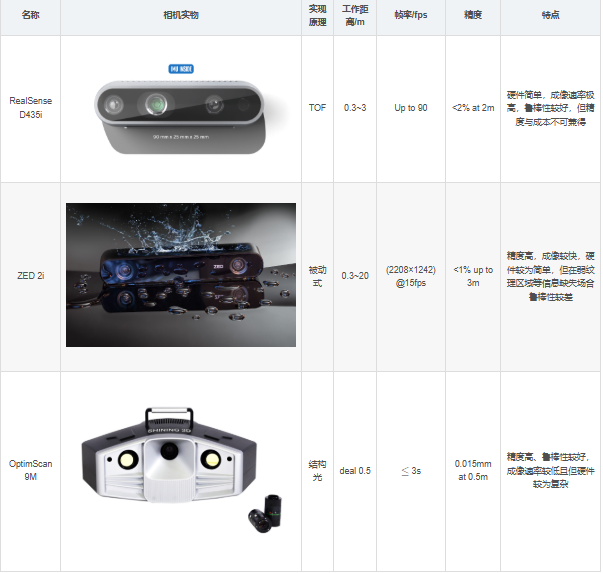

智能机器人焊接作业需要高精度的三维点云数据作为输入，并对点云进行分割以获取期望的轨迹信息； 
智能驾驶需要通过激光雷达获取到高精度的三维地图，再通过AI进行识别感知

## 3D结构光基本原理

类似 **给地形“喷颜料”** 

想象这样一个场景：

>   你站在一个完全平坦、单调的操场上，操场上什么标记都没有，没人能凭人眼分辨地面起伏 
>   这时，你拿着一把神奇的“喷漆枪”，往地面喷洒一条条整齐的彩色横条（就像公路上的减速带）。然后，站在一旁的摄影师用相机从侧面拍照 
>   如果地面有凹陷，那喷出的条纹就会被“压扁”或“拉伸”——比如凹下去的地方，线条看起来更密集；凸出来的地方，线条看起来被拉长。摄影师只要看照片，就能直观地看到哪块地面是凹的、哪块地面是凸的，然后凭这些条纹的变形，算出每个点“凹了多少”或“凸了多少”，从而还原出整个操场的三维起伏 

这个“喷漆枪＋摄影师”组合，正是结构光系统的核心思路——主动给物体“喷”上可测量的条纹，让相机去“抓”它们的变形，再通过几何恢复三维轮廓 

## 结构光系统

┌─────────────────────────────┐
│         计算单元            │
│  （PC 或嵌入式处理器）      │
│  • 解码条纹相位              │
│  • 三角测量计算深度          │
│  • 生成 3D 点云/高度图       │
└─────────────────────────────┘
             ▲
             │
    相机拍下的“变形条纹”图像
             │
             ▼
┌────────────┴────────────┐
│          相机            │
│  • 从侧面拍摄物体表面     │
│  • 同步接收投影仪图案     │
└────────────┬────────────┘
             │
             │ 被投影到物体上的
             │ “彩色横条”（编码图案）
             ▼
┌────────────┴────────────┐
│        被测物体表面       │
│  （操场、水果、零件等）   │
│  • 将条纹拉伸/压扁/偏移    │
└────────────┬────────────┘
             │
             │ 发射编码条纹光
             ▼
┌────────────┴────────────┐
│        投影仪（喷漆枪）   │
│  • 按预先设计的序列      │
│    投射黑白或彩色条纹     │
└──────────────────────────┘

## 核心逻辑---相位解码＋三角测量求解深度

1. **投影编码**

   * 设计一组条纹／灰度／相位图案序列，投影仪依次投射到场景。

2. **图像采集**

   * 相机与投影仪同步或按序拍摄，得到“变形前后”的图像序列。

3. **相位解码 & 反投影映射**

   * 从相机图像中的灰度值或相位变化，反算出每个像素在投影仪像平面上的“原始”条纹坐标。

4. **三角测量**

   * 已知：

     * 相机光心 $C$、投影仪光心 $P$ 的位置与姿态；
     * 相机内参矩阵 $K_c$、投影仪内参（若视为逆向相机）$K_p$。
   * 求解方程：

     $$
       C + t\,K_c^{-1}[u,v,1]^T
       \;\approx\;
       P + s\,K_p^{-1}[u_p,1]^T
     $$

     得到深度 $t$，从而恢复三维点 $(X,Y,Z)$。

5. **三维重建**

   * 将所有像素的 $(X,Y,Z)$ 组装成点云或网格，得到物体完整三维表面。

