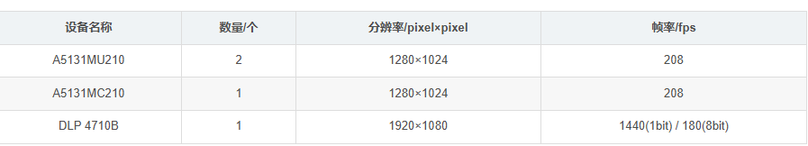

## 一、核心光学部件

1. **投影仪**

   * 型号：TI DLP 4710B
   * 分辨率：1920×1080
   * 刷新率：1440 Hz（1 bit）／180 Hz（8 bit）
   * 说明：采用“离焦投影”＋1 bit 编码以匹配相机高帧率

2. **相机阵列**

   * **3 台工业相机**，不是单一双目模块。

     1. **A5131MU210** × 2（灰度相机）
     2. **A5131MC210** × 1（彩色相机，可给点云上色）

   

   * 分辨率：1280×1024

   * 帧率：208 fps

   > 博主用 “小夹角”（投影仪＋彩色相机）＋“大夹角”（两台灰度相机）两组优势互补，提高速率又兼顾精度。

---

## 二、结构支撑与同步

3. **支架与基线设计**

   * 三脚架或定制支架，确保投影仪与三台相机的相对位姿（角度与距离）可调。
   * 两灰度相机大夹角，用于高精度重建；投影仪＋彩色相机小夹角，用于快速粗略扫描。

4. **触发与采集**

   * **硬件触发**（TTL 线）

     * 建议：投影仪触发相机（Output 2 每幅图案触发一次）
     * 最小曝光：1/208 s≈4808 µs
   * **接口**：USB 3.0（或 CameraLink／GigE POE）+ 同步线 BNC/DB9

---

## 三、标定与配套

5. **标定板**

   * 高精度平面棋盘或圆点板，用于同时标定相机内外参和投影仪“逆相机”模型。

6. **计算平台**

   * PC：i7+、16 GB RAM、必要时带 PCIe 采集卡
   * 软件：OpenCV + 自实现相位解码／三角测量算法

---

### 小结

* **不** 是用单一的双目相机模块，而是 **三台独立相机＋一台投影仪**
* 两组相机夹角互补：快速粗扫 + 精细重建
* 型号参考：A5131MU210、A5131MC210 + DLP 4710B
* 同步触发、曝光时序、支架布局、标定板和计算平台缺一不可。
