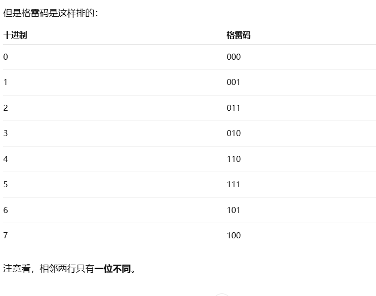

“相移互补格雷码”就是把两种结构光编码方法合二为一：

1. **格雷码（Gray Code）**：投一组黑白条纹，条纹宽度按二进制“格雷码”编码，让我们快速确定物体表面大致在哪条条纹区间（获取“粗深度”）。

编码方式：把 n 右移一位，然后和原始 n 做按位异或（XOR）

2. **相移法（Phase‐Shift）**：再投几幅相位略有偏移的正弦条纹，利用条纹亮度的变化精确计算出落在条纹内部的“亚条纹”位置（获取“精细深度偏移”）。

3. **互补组合**：格雷码告诉我们“这是第 k 条大条纹”，相移法告诉我们“在这条纹内部偏移了 φ”，二者相加就得到了完整的不含歧义的相位：

   $$
     \Phi = \underbrace{2\pi\;k}_{\text{格雷码粗相位}} \;+\;\underbrace{\phi}_{\text{相移法精确相位}}
   $$

4. **三维重建**：把无歧义相位 Φ 转成像平面坐标，再通过投影仪与相机的三角测量几何，算出每个像素的深度 Z，完成三维重建。

---

**数学逻辑与公式**

1. **格雷码解码**

   * 投射 $N$ 幅格雷码条纹图，灰度图像记为 $G_i(x,y)$。
   * 每个像素 $(x,y)$ 读取这 $N$ 位二值序列，转成十进制索引 $k(x,y)$。
   * 它表示该点的“粗相位区间”：

     $$
       \Phi_\text{coarse}(x,y) \;=\; 2\pi\,k(x,y).
     $$

2. **四步相移法**

   * 再投射 4 幅相移条纹，灰度值依次为
     $\;I_1,\;I_2,\;I_3,\;I_4\;$ ——它们分别是相位 $0,\tfrac{\pi}{2},\pi,\tfrac{3\pi}{2}$ 的正弦条纹。
   * 计算像素的**包裹相位**（Wrapped Phase）：

     $$
       \phi(x,y)
       = \mathrm{atan2}\bigl(I_4 - I_2,\;I_1 - I_3\bigr),
       \quad \phi\in(-\pi,\pi].
     $$

3. **相位解包（Phase Unwrapping）**

   * 把粗相位 $\Phi_\text{coarse}=2\pi k$ 加到包裹相位上，得到**不含歧义**的总相位：

     $$
       \Phi(x,y) = \Phi_\text{coarse}(x,y) + \phi(x,y).
     $$

>  包裹相位 = 当前亮暗条纹中“偏到了多少度”，但不告诉你在哪一圈
>  要想知道“在哪一圈”，就得靠格雷码来解包裹，得到完整相位

4. **坐标映射与深度计算**

   * 相机像平面上一点 $(u,v)$ 的视线可表示为
     $\; \mathbf{r}(t)=C + t\,K^{-1}[u,v,1]^T$。
   * 投影仪视线对应的方向由解出的 $\Phi$ 确定投影像素 $u_p = \frac{\Phi}{2\pi\,f}$（$f$ 为条纹频率）。
   * 令投影光心为 $P$、相机光心为 $C$、基线向量 $\mathbf{B}=P-C$，解三角测量方程组：

     $$
       C + t\,K^{-1}\!\begin{bmatrix}u\\v\\1\end{bmatrix}
       = P + s\,K_p^{-1}\!\begin{bmatrix}u_p\\1\end{bmatrix},
     $$

     求出参数 $t$，则该点三维坐标为
     $\;\mathbf{X} = C + t\,K^{-1}[u,v,1]^T$，其 $Z$ 分量就是深度。

通过这种“格雷码 + 四步相移”结合的方法，既保证了大视场内无歧义的深度索引，又能在条纹内部取得亚像素级的高度精度，是工业级结构光三维扫描的常见流程。
