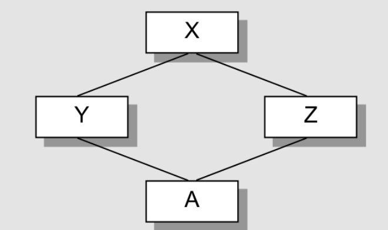

## 一个菱形继承中的各个类的大小

对于以下派生链<br>



上述X，Y，Z，A中都没有任何数据，那么它们的大小（占用的内存）是多大？

```cpp
class X();  					//1Byte
class Y ：public virtual X		//8Byte
{

};
class z : public virtual X		//8Byte
{

};
class A : public Y,public Z		//12Byte
{

};

```
对于空的class X，它实际上有一个隐藏的1Byte大小，那是被编译器安插进去的char，使得这个class的两个object在内存中配置独一无二的地址。<br>
如果空类的大小为0，那么它的所有对象都是一个地址，这是违背C++规范的。<br>

那么为什么 Y，Z，A的大小是8，8，12Byte？这些多出来额Byte是拿来的？

### 1.语言本身的额外负担
C++的某些特性会带来空间的额外开销，在这个例子中，类A是一个虚基类，在编译时对象中会产生一个额外的虚指针，指向虚基类子对象的地址 或其偏移地址。
这个指针的地址在32位机器上占4Byte

### 2.编译器对特殊情况所提供的优化处理
C++的编译器对派生类内存的优化处理是，将其各个基类的数据直接放在派生类对象的前端，派生类其实“吃下了”基类的内存。对于虚基类，其策略又有不同，虚基类子对象在派生链中只有一个共享实例，但总之呢,Y和Z还是“吃下了”X的内存。

### 3.机器的对齐限制
为了使得对象可以在内存中高效率的存取，对齐要将内存调整到机器位数的整数倍，在32位机器上，调整对齐为4Byte（32bit），以使bus的运输效率达到最高效<br>
所以X的对象为1Byte，无对齐，32位可以放多个X对象， 但将X对象放到Y,Z中，需要对齐，对象的拷贝行为是按照对齐的内存为边界的，否则在基类拷贝的时候会覆盖派生类的值 所以Y,Z的对象大小 1（X）+3（对齐）+ 4（虚指针）= 8 Byte ，而A对象的大小 （1（X）+3（对齐））*2 + 4（虚指针） = 12 Byte


