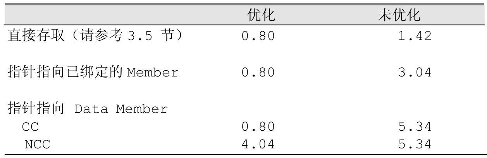
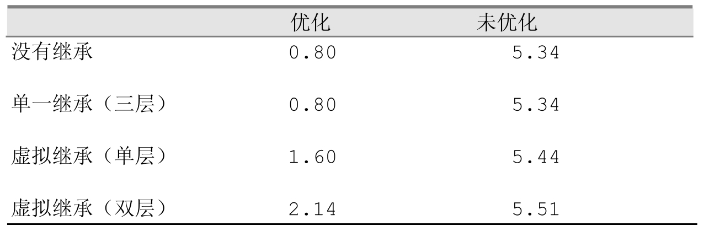

## 一.含义和用法
指向数据成员的指针，其类型为成员类型 类名::*，它得到的是data member 在类中的偏移量<br>
和普通的指针不同，普通指针指向变量在内存中的实际地址<br>
**用途**：通过这种方式，程序员可以在不知道具体对象地址的情况下，先保存成员的“偏移信息”，再结合具体对象实例来访问它<br>
大白话就是在地图中只给了data member的偏移地址，而不是实际地址，要访问它必须要通过对象实例(.*data member/->*data member)

**语法**： 

```cpp
float Point3d::*ax = &Point3d::x;

class Point3d
{
public:
    virtual ~Point3d();

protected:
    static Point3d origin;
    float x,y,z;
}

&Point3d::z  //代表z坐标在类中的偏移量（offset）
```

**&Point3d::z** 和 **&origin.z**的区别：<br>
前者得到的是z坐标在类中的偏移量(offset),后者是一个Point3d的对象，得到的是z坐标在内存中的真实地址<br>

```cpp
//z坐标在内存中的真实地址 - z坐标在类中的偏移地址 = 类的对象在内存中的首地址
&origin.z - &Point3d::z = &origin
```

**总结**
类型要区分：T C::* 表示“指向 C 中类型为 T 的数据成员”，而普通指针是 T*<br>
访问需要特定操作符：使用 .* 或 ->*，并总要有一个对象或对象指针来“填充”偏移量，才能取得实际值<br>
应用场景：当你需要在运行时根据不同成员名动态选择和访问类成员时，成员指针非常有用，例如在反射、序列化或 GUI 绑定中<br>


## 二.指向data member的指针的效率
和之前的类的数据成员的存取效率相比，对于指向data member的指针，它的加法，减法和赋值效率如何？<br>

```cpp

//普通指针
float *ax = &pA.x;

*bx = *ax - *bz;
*by = *ay + *bx;
*bz = *az + *by;

//指向数据成员的指针
float Point3d::*ax = &Point3d::x;

pB.*bx = pA.*ax - pB.*bz;
pB.*by = pA.*ay + pB.*bx;
pB.*bz = pA.*az + pB.*by;
```

**结论** ：



由于为每一个data member的存取操作加上了一层间接性，在未优化的情况下，执行之间增加了一倍以上，但开启优化之后，效率与存取普通成员的效率一致<br>



在继承关系中，由于被继承的data member是直接存放在class object中的，继承的引入并不会影响上面的这些测试代码的执行效率。虚拟继承影响测试代码执行效率的只要原因是其**抑制了编译器的优化**<br>
每一层虚拟继承都会导入一个额外层次的间接性：<br>
```cpp
pB.*bx

//会被转换为
&pB->_vbcPoint + (bx -1)

//而不是直接的
&pB + (bx -1)
```
额外的间接性会降低编译器将“所有处理都转移到寄存器中执行的”优化能力


