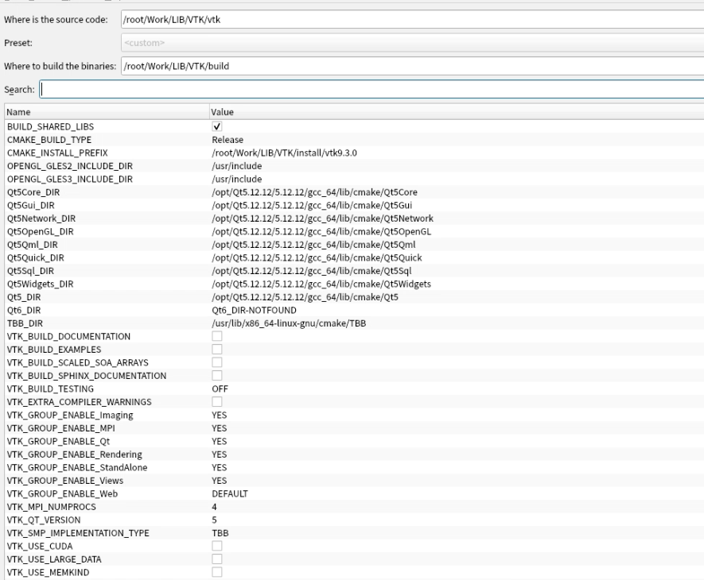

## 1. VTK9.3.0编译

``` sh
# 克隆 VTK 仓库
git clone https://gitlab.kitware.com/vtk/vtk.git
cd vtk

# 查看可用标签
git tag | grep "^v9\.3"

# 切换到 v9.3.0
git checkout v9.3.0

```
使用cmake-gui编译



然后在build目录下面

```
sudo make -jxx

sudo make install -jxx
```

## 2.编译Pcl1.14.0

```sh
# 克隆 PCL 仓库
git clone https://github.com/PointCloudLibrary/pcl.git
cd pcl

# 查看可用标签
git tag | grep "^pcl-1\.14"

# 切换到 pcl-1.14.0
git checkout pcl-1.14.0

```

使用Cmake—gui编译，选项如下：


