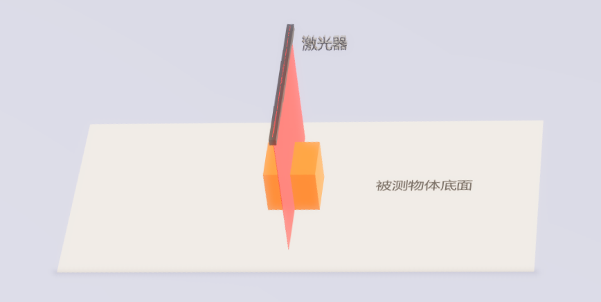
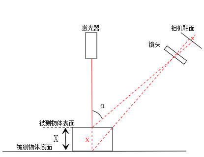
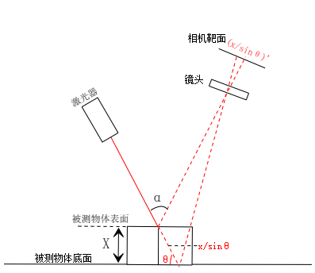
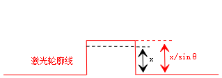
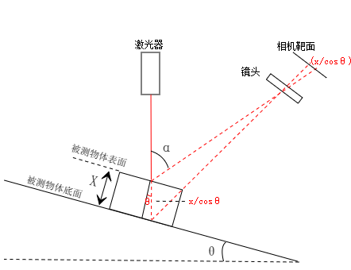
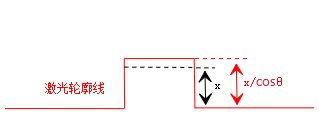
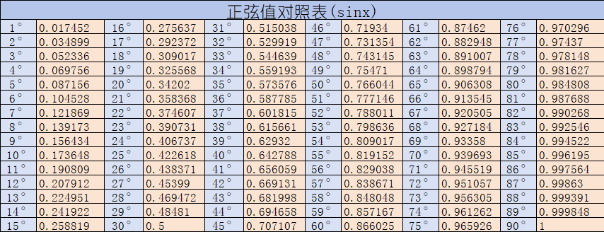
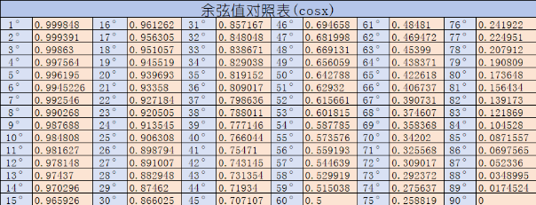

### 激光线扫相机成像受倾斜的影响关系

### 一、正常情况的激光成像（激光器与被测物体表面垂直）

如图所示，激光器与被测物体表面垂直的情况，激光线分别照射在被测物体表面以及底面上。 
被测物体表面距离底面的高度为x，物体表面的激光线与底面激光线的高度差同样为x，在相机靶面的投影距离为x'。 
此时激光相机得到的点云图能够正确地反应被测物体表面距离底面的高度差。

### 二、激光倾斜时的激光成像（激光线与运动方向不垂直）

如图所示，激光器与水平面的夹角的θ，被测物体水平放置，激光线分别照射在被测物体表面与底面上。 
此时被测物体表面距离底面的高度为x，物体表面的激光线与底面激光线的高度差为x/sinθ，在相机靶面的投影距离为(x/sinθ)'。 
此时激光相机得到的点云图会出现失真，被测物体表面距离底面的高度差会被拉伸。   

矫正方式： 
1、使用标定块，做一次基准扫描，获取标定块的高度差，用标定块高度差实际值除以标定块高度差检测值即可得到矫正系数， 
将产品检测的高度差乘以矫正系数即可得到实际高度差。该矫正方式仅适用于相机倾斜程度不变的情况。 
矫正系数=标定块高度差实际值/标定块高度差检测值 
实际高度差=检测高度差*矫正系数

2、已知激光器与水平面的夹角大小的情况下，可将高度差计算结果乘以sinθ得到矫正结果，sinθ的值可查询附录获得。该矫正方式仅适用于相机倾斜程度不变的情况。 
实际高度差=检测高度差*sinθ

### 三、物体倾斜时的激光成像

如图所示，激光器与水平面垂直，被测物体与水平面的夹角为θ，激光线分别照射在被测物体表面与底面上。 
此时被测物体表面距离底面的高度为x，物体表面的激光线与底面激光线的高度差为x/cosθ，在相机靶面的投影距离为(x/cosθ)'。 
此时激光相机得到的点云图会出现失真，被测物体表面距离底面的高度差会被拉伸。 
实际上第1类情况可以视为此类的特殊情况

矫正方式： 
1、可通过拟合平面的方式获取被测物体与水平面的夹角θ，进而计算出余弦值cosθ，将测得的高度差乘以cosθ，即可得到实际的高度差。 
该矫正方式的优点是可以根据来料倾斜程度的不同进行实时矫正。 
实际高度差=检测高度差*cosθ

2、使用标定块，做一次基准扫描，获取标定块的高度差，用标定块高度差实际值除以标定块高度差检测值即可得到矫正系数， 
将产品检测的高度差乘以矫正系数即可得到实际高度差。该矫正方式仅适用于产品倾斜程度不变的情况。 
矫正系数=标定块高度差实际值/标定块高度差检测值  
实际高度差=检测高度差*矫正系数

3、已知被检测物体与水平面的夹角大小的情况下，可将高度差计算结果乘以cosθ得到矫正结果，cosθ的值可查询附录获得。该矫正方式仅适用于被检测物体倾斜程度不变的情况。 
实际高度差=检测高度差*cosθ

### 四、附录

#### 1、正弦值对照表

#### 2、余弦值对照表

