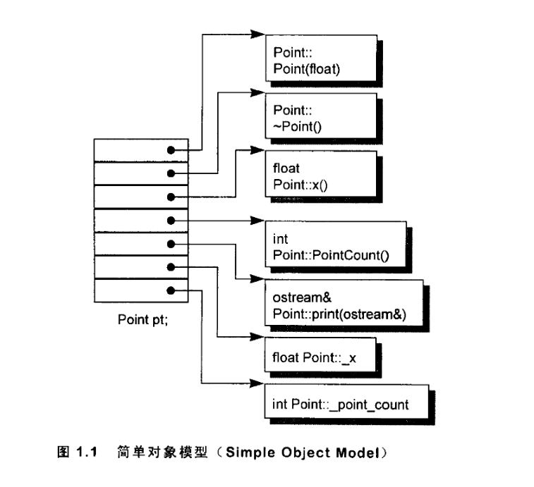
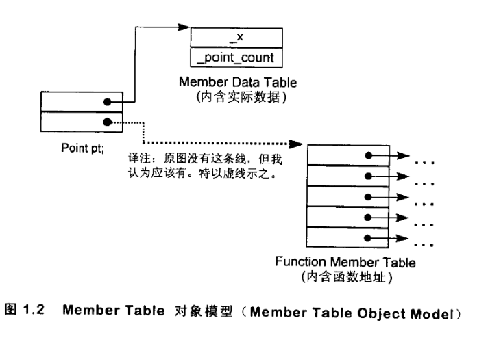
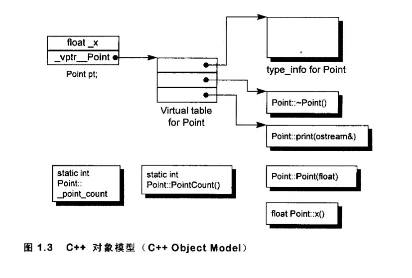

## 模型的设计思路和演化

### 1.简单对象模型：

将对象的内存空间分成很多个块，每个块都存一个指向其data Member 或者 function member
也就是说，数据和函数用相同的容器去装。 
对象所占的空间也容易计算：指针大小 x class中声明的成员的个数

这样做虽然具有一致性，但是要求每一个容器都要大于等于最大的函数所占的空间，这显然不合理 
所以只有 这里的 **索引方式** 被 C++模型采用了， 指向成员的指针（pointer to membr) 就是这样设计的

### 2.表格驱动的模型：

 

将data member 和 function member 用两个表分开存储  
data member table直接存数据成员， function member table 存函数成员的指针，通过指针可以在内存中找到函数的具体实现 
对象分成两个块，分别存指向 data member和function member的表格

这样做区分了数据和函数，减少空间的浪费，但是对于每一个数据成员来说，都需要通过指针间接寻址一次， 
对于函数成员来说，则需要进行两次间接寻址，造成额外的时间开销 
对于C++的设计的Zero-overhead Principle原则：不使用特性就不会（相对于C）增加开销，表格应用于data member 和function member都是不合理的

所以这里的 **表格多级索引方式**  被 C++应用在虚函数的构建中

### 3. C++对象模型

C++有两类 data member：静态和非静态 
有三类function member：静态，非静态 和 虚函数

其中：非静态数据成员直接存放在对象中（堆/栈），其他的所有的成员都在对象外 
静态数据成员（全局/静态存储区）

非静态成员函数，属于类，但是它只在代码段有一份内容，共所有的对象所共享 
静态成员函数，属于类，不需要对象实例来调用，不能访问this指针，也只在代码段有一份内容

虚函数，类的虚函数的具体实现还是放在 *代码段* 的，每一个虚函数都设置一个指针（指向代码段的虚函数具体实现的内存地址），这些指针放在每一个类的虚函数表（vrtb）中， 这个虚表（vrtb）放在对象中，在类被编译的时候就构建出来了，存在某一块内存区域，只要类中有虚函数（纯虚函数也可），就会生成虚表。

在虚基类实例化阶段， A* interface =  new C(); 在虚基类A实例化虚函数类C时，C的构造函数会设置vptr指向C的虚表（vtbl）

**缺点**：将 nonstatic data member 直接放到对象中的话，如果类中 nonstatic data member 修改，那么程序就需要重新编译

