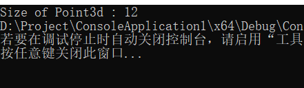

## C++在加上类的封装之后，布局成本增加了吗？

### C语言处理数据和函数

在C语言中，对于 数据 和 函数（处理数据的操作）是分开来声明的<br>
C语言本身不支持 数据和函数 的关联性
C是以功能为导向的，各个函数中包含的算法，处理的是共同的外部数据
以3D点数据为例：

```cpp
typedef struct point3d
{
	float x;
	float y;
	float z;
}Point3d;

//1.打印点数据
void Point3d_print(const Point3d *pd)
{
	printf("( %g, %g,%g) ", pd->x, pd->y, pd->z);
}


//1.打印点数据
#define Point3d_print( pd ) \
	printf( "( %g, %g,%g) ", pd->x, pd->y, pd->z );


void my_foo()
{
	//1.打印点数据
	Point3d *pd = get_a_point();

	printf("( %g, %g,%g) ", pd->x, pd->y, pd->z);

	//2. 设置点数据
	Point3d pt
	pt.x = 0.0;

}


//2. 设置点数据
#define X( p,xval ) (p.x) = ( xval );
 X(pt, 0.0);

```

不管是打印点的坐标值还是设置点的坐标值，点的内容对于全局来说是共同的数据

### C++ 处理数据和函数

与C语言不同，C++可以将数据和函数限定在一个class中，一个class中的函数，
可以使用类中的数据，而其他的类和类外的其他函数不能直接使用类的数据和函数

下面是C++对于Pointe3d的构建方式：

#### 1.直接实现
```cpp

 // C++
 class Point3d
 {

 public:
	 Point3d(float x = 0.0 .float y = 0.0, float z = 0.0)
		 : m_x(x), m_y(y), m_z(z)
	 {

	 }
	 float x() { return m_x };
	 float y() { return m_y };
	 float z() { return m_z };

	 void x(float xval)
	 {
		 m_x = xval;
	 }
	 void y(float yval)
	 {
		 m_y = yval;
	 }

	 void z(float zval)
	 {
		 m_z = zval;
	 }

 private:
	 float m_x;
	 float m_y;
	 float m_z;

};


 inline ostream & operator << (ostream &os, const Point3d &pt)
 {
	 os << "(" << pt.x() << ","
		 << pt.y() << "," << pt.z() << ")";
 };
```

#### 2.多重继承的方式实现

```cpp
 
 class Point {
 public:
	 Point(float x = 0.0) : m_x(x)
	 {

	 }
	 float x(){ return m_x; }
	 void x(float xval)
	 {
		 m_x = xval;
	 }

 protected:
	 float m_x;
 };

 class Point2 : public Point {
 public:
	 Point2d(float x = 0.0, float y = 0.0) :  Point(x), m_y(y)
	 {

	 }
	 float y() { return m_y; }

	 void y(float yval)
	 {
		 m_y = yval;
	 }

 protected:
	 float m_y;
 };

 class Point3d : public Point2d {

 public:
	 Point3d(float x = 0.0, float y = 0.0, float z = 0.0) : Point2d(x, y), m_z(z)
	 {

	 }
	 float z() { return m_z; }

	 void z(float zval)
	 {
		 m_z = zval;
	 }

 protected:
	 flaot m_z;
 };
```

#### 3.参数模板方式实现

```cpp

 template < class type >

 class Point3d
 {
 public:
	 Point3d(type x = 0.0, type y = 0.0, type z = 0.0)
		 : m_x(x), m_y(y), m_z(z)
	 {

	 }
	 type x() { return  m_x; }

	 void x(type xval)
	 {
		 m_x = xval;
	 }

 protected:

	 type m_x;
	 type m_y;
	 type m_z;


 };


 template < class type, int dim >
 class Point
 {
 public:
	 Point();
	 Point(type coords[dim]) {
		 for (int idx = 0; index < dim; idx++)
		 {
			 m_coords[idx] = coords[idx];
		 }
	 }

	 type& operator[](int idx) {
		 assert(idx < dim && idx >= 0);
		 return_coords[idx];
	 }

	 type operator[](int idx) const
	 {
		 assert(idx < dim && idx >= 0);
		 return _coords[idx];
	 }

 private:
	 type_coords[dim];

 };

 inline  template < class type, int dim >
	 ostream& operator << (ostream &os, const Point < type, dim >&pt)
 {
	 os << "(";
	 for (int i = 0; i < dim - 1; i++)
	 {
		 os << pt[i] << ",";
	 }
	 os << pt[dim - 1];
	 os << ")";
 }
```

在C++中实现的3D坐标点，比在C中实现要复杂，尤其是在template的情况下
这是不是意味着 加上了封装之后的C++ Point3d产生了额外的布局成本，

答案是否定的：**封装不会带来额外的空间和时间开销**

*1.空间开销*

首先，数据成员，C的数据成员直接存储在C的结构体对象中，C++的数据成员直接存储在类的对象中，
其次，成员函数，类的成员函数存在程序的代码段（code Section）中，不在对象中，由所有对象共享

*2.时间开销*

函数调用所需要的时间和C相同

**函数调用的本质**

```c

void point3d_set(struct Point3d* this, float a, float b, float c) 
{ 
  this->x = a; 
  this->y = b; 
  this->z = c; 
}
```

通过 this 指针访问对象的数据成员,C语言是显式传递this指针，C++编译器会将成员函数转换成c，隐式传递this指针
所以开销是一样的

这解释了C++ 的设计的 “零开销原则”（Zero-overhead Principle）：

空间成本：封装后的类对象大小与 C 结构体相同（仅包含数据成员）

时间成本：成员函数的调用与普通函数调用等价，无额外运行时开销（虚函数除外）

访问控制：private/public 是编译期检查，不影响运行时性能

*3.在控制台中打印Point3d所占的内存空间大小*

C和C++类的三种写法的Pointe3d的大小，得到的结果都是统一的12字节

