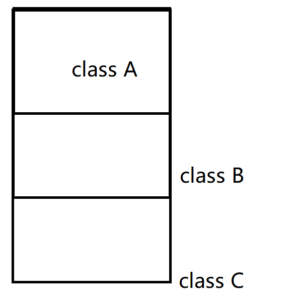

## C++程序设计模型的3种范式

C++程序设计模型直接支持3种programming paradigms（程序设计范式）

### 1.程序模型（procedural model）

典型的C语言的设计模型，面向过程，通过函数分解问题，算法顺序执行

### 2.抽象数据类型模型（ADT model）

ADT强调的是C++的封装这一特性，可以将数据封装为私有 
对应的函数实现的细节也可以隐藏， 
然后通过调用公有的函数接口来执行。 
用户调用接口，无需关心函数是怎样实现的

### 3.面向对象模型（OOP model）

这种模型强调的是多态的特性，封装和继承实际上是为多态提供条件 
典型的范式是：基类定义公共接口，派生类扩展或重写虚函数行为

关键机制：

a.动态绑定：在虚函数基类实例化派生类的对象时，A *interface = new C(); 
将对象与对应的类C的实例绑定。虚拟继承中，基类只有一份实例，它可以和所有的派生类绑定,
但每次只能绑定其中一个

b.运行时多态：基于动态绑定，通过虚表（vtbl）链接对应的类的虚函数

## 三种设计模型并不能任意组合混用

场景：若直接通过基类对象（而非指针或引用） A obj = C(); 
obj.callFunA(); (假设基类和所有的派生类都有这个接口) 

这种情况下obj对象是无法调用派生类C的callFunA的，它调用的实际上是基类的callFunA， 
显然，这种情况下无法实现多态调用，原因在下面解释：

### 指针和引用为什么可以

*指针*：

* a.一个指针，不管它指向的是哪一种类型的数据，指针本身所需的内存大小是固定不变的 
* b.指针指向的是某一个内存空间的首地址  
* c.不同类型的指针之间的**本质区别**在于**其寻址范围的不同** 
explain：    
在32位系统中，int型指针的寻址范围为4Byte，double型指针的寻址范围为8Byte 
一个void*指针要寻址的范围是未定的，无法通过它来对Object寻址，必须先转化 
对于某一个对象的指针来说，其寻址范围和类的大小相同。 

这里，interface指针的寻址范围就是A类的对象的大小，看下面的图：

可以明确：基类的大小是最小的，每一个派生类的内存中都包含了其对应的基类的内存，
所以interface指针只能寻址到class A的范围，该指针是无法取到class B，和CLass C的私有数据的。

那么通过指针是如何实现多态的？ 
答案是通过虚表，在A *interface = new C();过程中，类C的构造函数将interface指针指向了
类C的虚表，通过虚表寻址可以获得类C中对应虚函数的实现。注意这里new C() 返回的是 *C。

*引用*：

引用（Referance）的 **本质** 是一个常量指针(T* const),它保存的是对象的地址，但语法上表现为别名 
A &ref = c; 实际上和 A* const interface = &C 将对象C绑定 

其实现多态的底层逻辑和指针完全一致：

* 通过虚指针和虚表实现多态 
* 通过虚表找到对应派生类实现的虚函数 进行动态绑定

综上，基类A的非指针或引用对象无法调用其派生类的虚函数实现的原因 
在于**A对象的内存中不包含其派生类的私有数据及其函数实现**，当然不可能调到。 
那么 A interface = C(); interface对象中仅包含类A的内容，不包含类C增加的部分，
也拿不到类C的指针，无法实现多态。