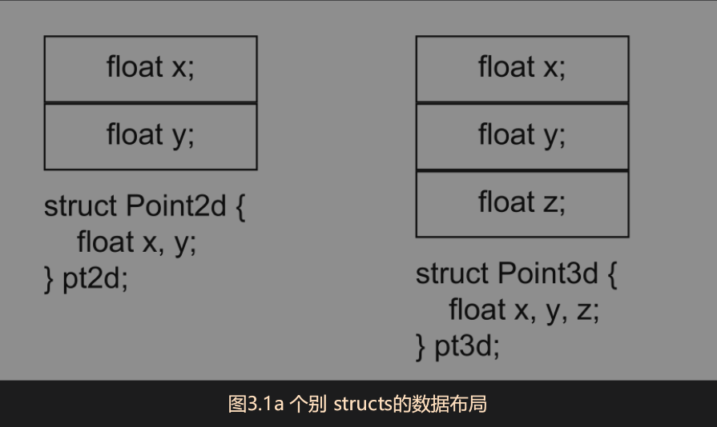

在C++模型中，一个派生类对象所表现出来的东西，是其自己的 members 加上其 base class(es) Member的总和。<br>
那么在派生类中，是先排列自己的Member，还是先排列其各基类的 member？member究竟是用什么逻辑排列的？<br>
具体需要分为以下四种情况讨论：单一继承且不含 virtual functions，单一继承并含有virtual functions，多重继承，虚拟继承

## 一.单一继承但不包含虚函数

### 1.两个抽象数据类型(无继承)

```cpp
class Point2d{
public:
    //constructor(s)

private:
    float x,y;

};

class Point3d{
public:
    //constructor(s)

private:
    float x,y,z;
}
```
这种情况和C 中的Struct数据的布局完全相同




### 2. 带有继承的抽象数据类型

如果程序员希望，不论是2D或是3D坐标点，都可以共享一个实例，
这个设计策略就是从Point2d派生出Point3d，这样，Point3d就继承了x，y坐标的一切（包括数据实例和操作方法。数据本身和数据的处理方法）

```cpp
class Point2d 
 {
 public:
	 Point2d(float x = 0.0, float y = 0.0) :  m_x(x), m_y(y)
	 {

	 }
	 float x() { return m_x; }
	 float y() { return m_y; }

	 void x(float xval)
	 {
		 m_x = xval;
	 }
	 void y(float yval)
	 {
		 m_y = yval;
	 }

	 void operator += (const Point2d& rhs) {
		 m_x += rhs.x();
		 m_y += rhs.y();
	 }

 protected:
	 float m_x,m_y;
 };

 class Point3d : public Point2d 
 {

 public:
	 Point3d(float x = 0.0, float y = 0.0, float z = 0.0) : Point2d(x, y), m_z(z)
	 {

	 }
	 float z() { return m_z; }

	 void z(float zval)
	 {
		 m_z = zval;
	 }
	 void operator += (const Point3d& rhs) {
		 Point2d::operator +=  (rhs);
		 m_z += rhs.z();
	 }

 protected:
	 float m_z;
 }

```
这种数据基于继承的抽象数据类型和前面的那一种单独的Point3d在内存布局和占用上有什么区别吗？<br>

答案是没有。这种方式和Ｃ struct 的数据布局仍然是相同的，data member在对象中连续存储


### 3.对于继承的误解

#### a.在继承关系中重复设计相同功能的函数
比如上诉2中的构造函数和操作符重载，重复设计会带来额外的开销

#### b.不能将两个完全无关的类强行组合为继承关系

看下面的例子：  

```cpp
 class Concrete {
 public:
	 //constructor(s)

 private:
	 int val;
	 char c1;
	 char c2;
	 char c3;
 };

```
如果将其强制拆解成下面的继承方式：

```cpp
class Concrete1 {
 public:
	 //constructor(s)

 private:
	 int val;
	 char c1;
 };

 class Concrete2 : public Concrete1 {
 public:
	 //constructor(s)

 private:
	 int val;
	 char c1;
	 char c2;

 };


 class Concrete3 : public Concrete2 {
 public:
	 //constructor(s)

 private:
	 int val;
	 char c1;
	 char c2;
	 char c3;
 };
```
这个类 Concrete3 对比原来的 Concrete 的内存布局是一样的吗？<br>
答案是否定的。<br>
这是因为基类存在内存对齐填充（Padding），这样随着继承深度的增加，内存会不断增大<br>
你说这不符合C++继承的设计逻辑，对啊，所以这是错误的用法嘛。


### 4.为什么C++要求基类成员在内存中连续且不可分割

根据C++标准，派生类对象必须完整包含基类子对象，这意味着基类子对象的内存布局在派生类中必须保持原样，包括填充字节。<br>
如果编译器为了优化派生类的内存布局，重新利用了基类的填充空间来存放派生类的成员,会发生什么呢？<br>


那么如果派生类在基类的填充空间中放置了自己的成员，当基类子对象被复制时（复制操作只复制基类的内存布局），原本属于基类的填充空间现在被派生类成员占用，复制操作可能会覆盖这些派生类成员的数据，导致不可预料的后果。


这里派生类的成员bit2会被覆盖掉

## 二.单一继承且包含虚函数

如果要处理一个坐标点，而不打算在乎它是一个Point2d 或Point3d 实例，那么就需要在继承关系中提供一个virtual function接口。

```cpp

class Point2d
{
public:
	Point2d(float x = 0.0, float y = 0.0) : m_x(x), m_y(y)
	{

	}
	float x() { return m_x; }
	float y() { return m_y; }

	void x(float xval)
	{
		m_x = xval;
	}
	void y(float yval)
	{
		m_y = yval;
	}

	virtual  float z() { return 0.0; }
	virtual  void z(float )  {  }

	 virtual void operator += (const Point2d& rhs) {
		m_x += rhs.x();
		m_y += rhs.y();
	}

protected:
	float m_x, m_y;
};

class Point3d : public Point2d
{

public:
	Point3d(float x = 0.0, float y = 0.0, float z = 0.0) : Point2d(x, y), m_z(z)
	{

	}
	float z() override { return m_z; }

	void z(float zval) override
	{
		m_z = zval;
	}
	void operator += (const Point2d& rhs) override  //注意这里是Point2d而不是Point3d
	{  
		Point2d::operator +=  (rhs);
		m_z += rhs.z();
	}

protected:
	float m_z;
}
```
虽然class的声明语法没有改变，但每一件事情都不一样了：两个z（​） me mber functions 以及 operator+=（​）运算符都成了虚拟函数；每一个 Point3d clas s object内含一个额外的vptr member（继承自Point2d ）​；多了一个Point3d virtual table。


这里将虚函数指针vptr放在了基类的尾端，实际上当前的很多编译器也将vptr放在基类的首端。


## 三.多重继承


## 四.虚拟继承


explain：需要注意的是，在C++中，一般而言，任何一条通则一旦碰上 virtual base class就没辙了。