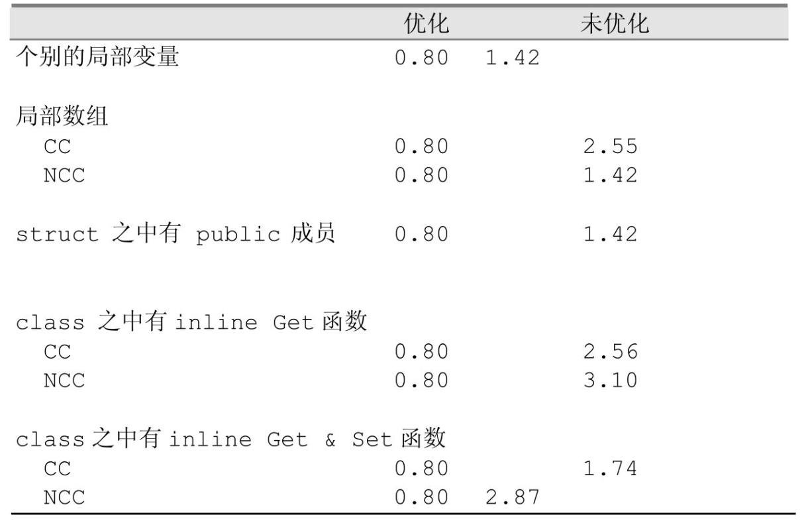
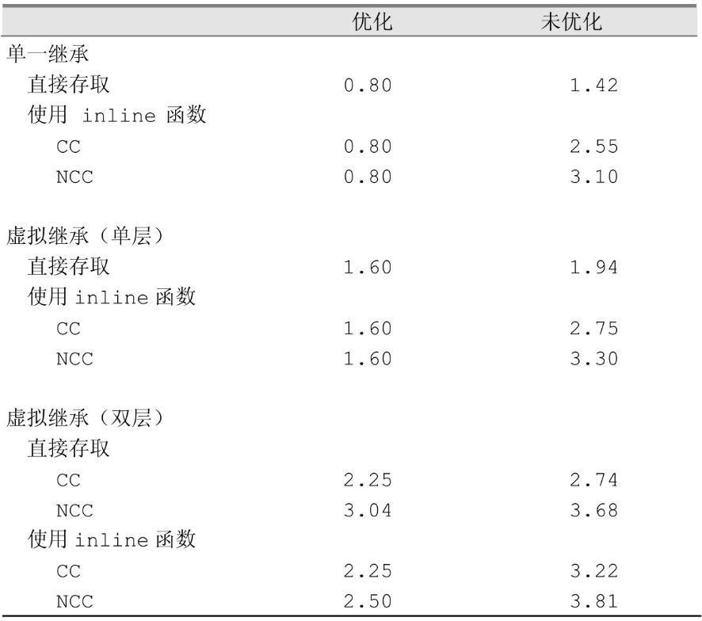

## 一.数据的调用

用对象来调用数据和用指针来调用数据有什么不同呢？<br>
答案是有非常大的差异，除了调用静态数据成员时完全相同之外，对于其他的数据成员都会有差异。

### 1.静态数据成员

* a.只在类的生命周期内可见，可以看作是类的全局变量，每个静态数据成员只有一个实例，存放在程序的data segment中<br>
* b.静态数据成员不会带来额外的空间和时间上的额外开销，不管它属于哪个类，在类中是public,protected还是private<br>
* c.使用对象和指针来调用静态数据成员，是完全相同的，通过.运算符来调用只是文法上方便而已，实际和指针一样<br>
* d.静态数据成员的调用不受复杂的继承关系影响，就算是虚继承也一样。程序中静态数据成员只有唯一的一个实例，存取的路径是一致的。<br>
* e.如果直接采用函数调用静态数据成员，foo().chunkSize,编译器会直接将它丢弃<br>
* f.取一个静态数据成员的地址，会得到一个指向其数据类型的指针，而不是一个指向类成员的指针，因为静态数据成员本身不在类的对象中<br>

```cpp
&Point3d::chunkSize;
//会得到对应类型的内存地址
const int*

```
* g.如果两个类都有一个重名的静态数据成员，编译器会对其进行name-mangling。（支持推导出独一无二的名称和方向推导对应的类）<br>


### 2.非静态数据成员

* a. 非静态数据成员直接存放在类的对象中,只能通过类的对象来调用<br>
* b. 调用时会产生隐式转换（通过implicit class object由this指针完成）<br>

```cpp
Point3d::translate(const Point3d &pt)
{
    x += pt.x;
    y += pt.y;    
    z += pt.z;
}
Point3d::translate( Point3d *const this, const Point3d &pt)
{
    this->x += pt.x;
    this->y += pt.y;    
    this->z += pt.z;
}
```

* c. 要对一个非静态数据成员进行调用，编译器需要把class object的起始地址加上data member的偏移位置<br>

```cpp
origin._y = 0.0;

//那么地址&origin._y将等于
&origin + (&Point3d::_y -1);

//减一操作：指向data member的指针，其offset值总是被加一，
//这样可以使编译器系统区分出  一个指向data member的指针，没有指出任何member
//这种情况
```
* d.每一个非静态数据成员的偏移地址在编译期就已经确定了。在单一继承链中，对于非静态数据成员的调用的效率和
存取一个C struct member是一样的。<br>

* 在多重继承中理论上应该和C struct相同，在虚拟继承中会稍慢一点。

最后，从对象存取和从指针存取有什么区别？<br>
答案是：当Point3d是一个派生类，其继承结构中有一个虚基类，且要存取的是从虚基类继承而来的data member时，完全不同<br>
用指针存取时，在编译时期无法得到这个成员的实际的偏移地址，只能在执行期通过虚基类表指针或虚指针间接存取<br>
通过对象则永远访问的都是Point3d类本身的数据成员。


## 二.数据调用的效率

### 1.封装会影响执行期效率吗？



上图中，依次测试了数据成员类型：C中的局部变量，局部数组，封装成C struct ，封装成C++类（类中有inline Get），封装成C++类（类中有inline Get & Set）<br>可以看到，在未开启编译器优化时，封装对执行期效率有一些影响，但开启优化后，所有的类型都能达到相同的执行效率。

### 2.继承会影响执行期效率吗？



可以看到，单一继承不会影响数据成员执行期的效率，而虚拟继承会，并且随着层数的增加，执行效率会不断降低。即便开启优化，也无法弥补，因为通过虚基类表的间接
存取压制了“把所有运算都移到寄存器执行”的优化能力。

### 3.优化操作到底做了什么？
* a 寄存器分配：将频繁访问的变量保留在寄存器中，避免重复访问内存<br>

* b 循环展开：减少分支和地址计算的开销

* c 消除冗余指令：合并地址计算和内存访问操作


