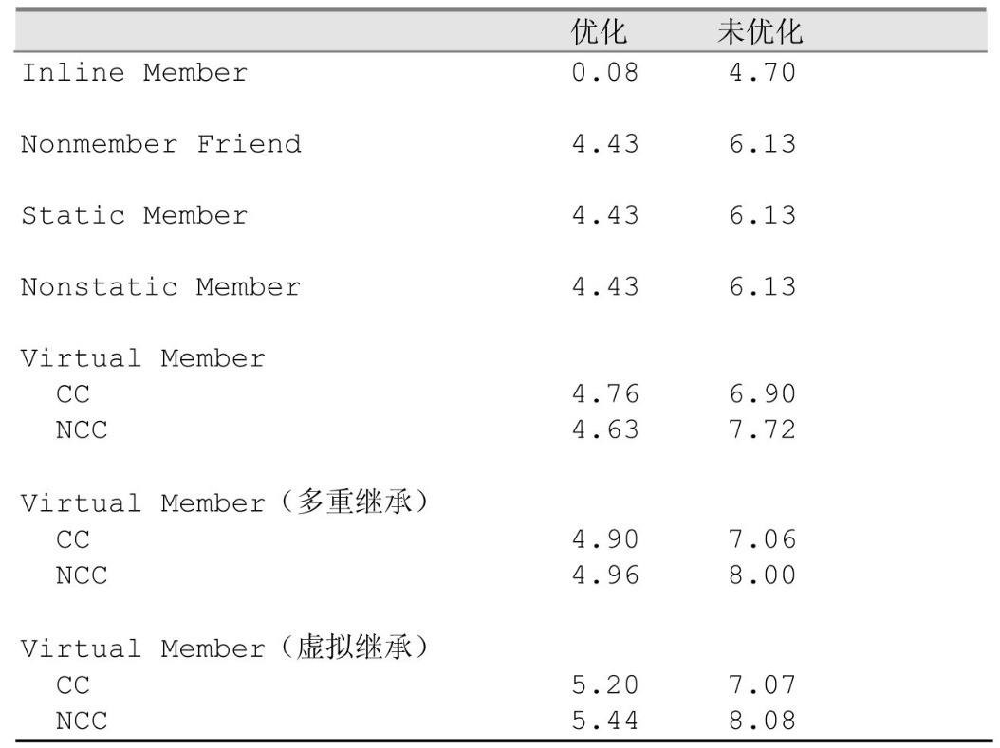

## 两个3D点坐标的加减

对于不同类型的两个3D点加减的函数，执行1000万次，讨论执行效率。

```cpp
void cross_product( const Point3d &pA,const Point3d &pB)
{
    Point3d pC;

    pC.x = pA.y * pB.z - pA.z * pB.y;
    pC.y = pA.z * pB.x - pA.x * pB.z;
    pC.z = pA.x * pB.y - pA.y * pB.x;
}
```

以上的函数体加上不同的关键字修饰或该数据类型后，可以是内联函数，类的非静态成员函数，类的静态成员函数,<br>
也可以是友元函数，虚函数（单一继承，多重继承，虚拟继承）<br>
以下是其对应在编译器中实际运行的测试结果：



从表中可以得出：<br>
* 类的静态成员函数，类的非静态成员函数，以及类的友元函数的执行效率完全相同。<br>
* 内联函数的执行效率最高，无论是否开启优化，这惊人的结果归功于编译器将"被视为不变的表达式"提到了循环之外，因此只计算一次,
inline函数不只能*节省一般函数调用所带来的额外负担*，也提供了**程序优化的额外机会**<br>
* 虚函数的执行效率比非虚函数要低，而且多重继承执行就更慢了，虚拟继承更甚<br>


## 探讨调用过程中构造是否会被调用
在测试单一继承的层数增加时，执行时间也在增加，很令人困惑是不是？这中间发生了什么？<br>
实际上不管单一继承的深度如何，主循环中用以调用的函数额代码是完全相同的，<br>
其间的不同在于函数中出现的局部性的Point3d pC;于是Pointe3d的构造函数每一次都会被调用，造成调用时间增加<br>
如果把局部对象放到函数的参数中：

```cpp
void  cross_product(Point3d &pC, const Point3d &pA,const Point3d &pB)
{
    pC.x = pA.y * pB.z - pA.z * pB.y;
    pC.y = pA.z * pB.x - pA.x * pB.z;
    pC.z = pA.x * pB.y - pA.y * pB.x;
}
```
但实际上在未优化时效率和之前一模一样，**C++语言并没有省略默认构造函数调用的机制**，局部性的 pC的 class object即使没有使用，还是需要一个构造函数。
