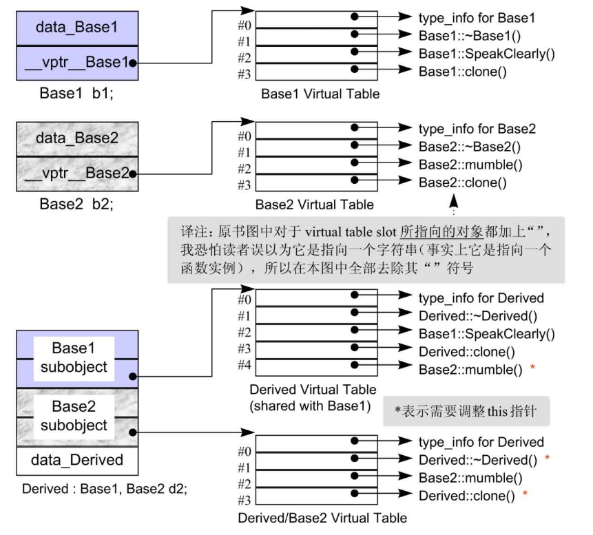

## 什么是编译器，什么是执行期

编译器在执行期都做了些什么，才能确保包含虚函数的各类函数的调用正确无误？<br>
首先我们来讨论一下什么是编译期，什么是执行期<br>

**编译期（compile time）**：将C++源码翻译成目标代码（机器码）的那段时间，在这期间，编译器只关注：<br>
* a.语法合法性<br>
* b.类型匹配<br>
* c.模板实例化<br>
* d.生成函数的二进制指令，如生成虚表，生成构造函数中的vptr初始化指令等,但不会在这一阶段执行构造函数，更不会分配内存空间<br>
*没有对象，只处理类型*:在编译期，编译器对每一个 class/struct 都会记录其成员、函数和虚函数表布局，但它并不产生任何真正的“实例”或“对象内存”<br>

**执行期**：<br>
* a.对象的创建与构造：一旦程序执行到<br>
栈上对象定义（如 MyClass obj;）<br>
堆上分配（如 new MyClass();）<br>
就会在运行期分配内存，并调用构造函数，其中也包含了编译器在编译期插入的那条写 vptr 的指令<br>
* b.虚指针(vptr赋值) ：<br>
MyClass obj 只能由当前类的构造函数为vptr赋值，不展现多态<br>
new MyClass(); new Derived()这种方式基类的对象可以用派生类来实例化，调用派生类的构造函数为vptr赋值，展现多态性<br>


如果让我们忘记vptr和虚表。
对于执行期虚函数的调用ptr->z()，要如何实现？首先ptr需要知道z()属于哪个对象，其次它需要知道z()这个成员函数是什么类型以唯一定位它的地址<br>
难道ptr需要存储上面两项额外的信息吗？这样做有两个明显的弊端：<br>
* 1)明显增加了空间开销，即使程序并不使用多态<br>
* 2)打破了与C函数之间的兼容性

显然上面的两项额外信息不能和指针存在一处，那把它们存在指针所在的对象中？<br>
那要避免程序不使用多态还存有多余的信息,在什么情况下才存呢？<br>
答案是类中存在虚函数的时候，显然这第一份额外的指明要调用的函数的所属对象的信息，就是vptr<br>
存第二份信息的目的是为了接下来找到对应的函数的地址(对象所对应的类中有多个函数，哪一个才是要调用的？)，这就是虚表所做的事，它按照虚拟成员函数声明的顺序，将虚函数对应的具体实现地址放到表格中，这个虚表为只读，不可改写，在编译时就已经生成。在执行期，对象就可以查表找到需要调用的虚函数<br>
所以是vptr和虚表的结合，实现了执行期多态。程序只是按照设定的逻辑去实例化，指向要调用的那个类的虚表，再通过虚表查找对应要调用的那个函数。
接下来讨论继承中的情况

## 单一继承的虚函数调用
每个class只会有一个虚表，表中是对应class object中所有active virtual function的地址<br>
active virtual function有：<br>
* a.当前类的虚函数实例，它改写了base class virtual function 函数实例<br>
* b.继承自base class的函数实例，派生类不改写虚函数<br>
* c. 一个纯虚函数


这种情况下虚函数调用符合之前所述a.虚指针链接虚表，虚表查找对应的虚函数实现，b.this 指针隐式转换，c.编译器重命名函数的逻辑

## 多重继承的虚函数调用

其复杂度围绕在第二个及后继的 base classes身上，以及“必须在执行期调整this 指针”，
策略的重点在于**this 指针的运行时调整** 和 **虚表（vtable）的管理**

### this指针运行时调整
```cpp
class Base1 
{ 
public:
    virtual ~Base1() {}
    virtual void mumble() {}
    virtual Base1* clone() const { return new Base1(*this); }
};

class Base2 
{ 
public:
    virtual ~Base2() {}
    virtual Base2* clone() const { return new Base2(*this); }
};

class Derived : public Base1, public Base2 
{
public:
    virtual ~Derived() {}
    virtual Derived* clone() const { return new Derived(*this); }
};
```



“Derived 支持virtual functions”的困难度，统统落在Base2 subobject 身上。有三个问题需要解决，以此例而言分别是(1) virtual destructor，(2) 被继承下来的Base2::mumble() ，(3) 一组clone() 函数实例。

```shell
Derived* der;                  // 完整对象指针
size_t ofs1 = 0;               // Base1 子对象在 Derived 内的偏移 
size_t ofs2 = sizeof(Base1);   // Base2 子对象相对于 Derived 开头的偏移 
```

* a.通过 第二个base class的指针，调用derived class virtual function

```shell
#入口：p2 指向 Derived 的 Base2 子对象
Base2* p2 = der + ofs2;             // 简写：der + sizeof(Base1) 
#调整到完整对象
Derived* full = p2 - ofs2;          // 减去 ofs2 回到完整对象 
#调用真正的析构
full->~Derived();
```
在多重继承里，Derived 的 Base2 子对象位于完整对象地址之后 ofs2 字节处，当通过 Base2* p2 调用时，要做减法（p2 - ofs2）而不是加法，才能得到原始的 Derived*

* b.通过 Base1* 调用继承自 Base2::mumble()<br>

```shell
#入口：p1 指向 Derived 的 Base1 子对象
Base1* p1 = der + ofs1;             // ofs1=0，直接指向 der 
# 调整到完整对象
Derived* full = p1 - ofs1;          // 减去 ofs1 回到完整对象
# 再定位到 Base2 子对象
Base2* real2  = full + ofs2;        // 加上 ofs2 定位到 Base2 子对象
# 调用 Base2::mumble()
real2->mumble();                    // 方法定义在 Base2，需要偏移 
```
* c 通过 Base2* 调用 Derived 覆盖自 Base2::clone() （协变返回）

```shell
# 入口：p2 指向 Derived 的 Base2 子对象
Base2* p2 = der + ofs2;            
# 调整到完整对象
Derived* full     = p2 - ofs2;             // 回到完整对象
# 调用覆盖的 clone，返回的是 Derived*
Derived* new_full = full->clone();         // 协变返回 
# 返回时，再偏移到 Base2 子对象
Base2* ret2       = new_full + ofs2;
return ret2;
```

### 虚表管理

在虚函数的多重继承中，派生类可能含有多个虚表<br>
* 每个基类对应一个虚表：Derived 会为 Base1 和 Base2 各维护一个虚表。

* 虚表内容：<br>
    主虚表（与 Base1 共享）：包含 ~Derived(), mumble(), clone()
    次虚表（与 Base2 共享）：包含 ~Derived() 的 Thunk 和 clone() 的 Thunk

+----------------+----------------+----------------+
| Base1 子对象   | Base2 子对象   | Derived 成员    |
| (vptr → vtbl_Base1) | (vptr → vtbl_Base2) |                |
+----------------+----------------+----------------+


**优化**：<br>
* 虚表合并：将多个虚表链接为单个实体，通过偏移量访问次要虚表
* 优势：减少符号数量，加快动态链接速度
    主虚表名称：vtbl_Derived
    次虚表位置：vtbl_Derived + offset

