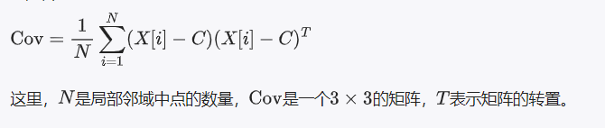

 #### 标量场
        想象一下，你有一堆小球，每个小球都放在地板上的不同位置。现在，我们要给每个小球标记一些信息，比如颜色深浅、大小、距离墙壁的远近等。标量场，就像是给这些小球贴上标签一样，这些标签上写着不同的信息，比如“这个小球很大”或“那个小球离门很远”。

        在CloudCompare这个软件里，我们处理的不是小球，而是点云——也就是很多很多的小点。标量场就是给这些点贴上了标签，标签上可以记录各种信息。比如：

        - 颜色标签：说明点是红的、绿的还是蓝的。
        - 距离标签：告诉我们这个点离某个特定位置有多远。
        - 高度标签：指出点的高度，比如它在山顶还是山脚。

        创建标量场，就像是做一个调查，然后根据调查结果给每个点贴上不同的标签。编辑标量场，就像是更新这些调查信息，或者改变我们想要关注的信息类型。

        简单来说，标量场就是一种给点云中的每个点附加额外信息的方式

#### 标量场计算 
       计算点云中每个点的标量场值是一个将点云的现有属性转换为新的数值信息的过程。这个过程基于数学表达式或函数，它将点云的一种或多种属性作为输入，输出一个新的数值（即标量值）

        - **属性转换**：点云的每个点都有其固有属性，如坐标（X, Y, Z）、颜色（R, G, B）、法向量等。标量场的计算就是基于这些属性，通过数学表达式将它们转换成一个新的数值（标量值）。这个转换过程可以是简单的数学运算，也可以是更复杂的函数计算。

        - **数学表达式**：表达式定义了如何从一个或多个输入属性计算出标量值。这个表达式可以非常简单，如计算点的亮度平均值（`(R + G + B) / 3`），也可以是更复杂的几何或物理计算，如计算点云中每个点相对于原点的距离，可以使用表达式 sqrt(X^2 + Y^2 + Z^2)。

        - 应用
        - **度量和信息提取**：通过计算新的标量场，我们可以提取点云数据中的有用信息，如距离、高度、密度等。这些信息对于进一步的数据分析和理解至关重要。

        - **数据可视化**：计算得到的标量值可以用于点云的可视化。通过将标量值映射到颜色或大小，我们可以直观地观察点云中信息的分布，比如高度图、密度图等。
        
        - 总结
        标量场的计算是一个将点云的固有属性转换成新的数值信息的过程。这个过程依赖于数学表达式，这些表达式使用点云的现有属性作为输入，输出反映特定信息或度量的标量值。

#### 3D重建
    1.预处理：将点云数据导入，去噪声
    2.配准：先选择共同的参考点或特征点手动对齐，再使用迭代最近点ICP算法自动对齐
    3.构建表面：点云数据本身不包含表面信息，需要通过网格化过程来生成表面。采用“泊松重建”从点云中创建网格模型。生成网格后进一步优化（填补孔洞，平滑网格）。

    泊松重建：通过一个泊松方程来从点云中重建出三维模型的表面。主要思想是利用点云的位置信息和法线信息来构造一个隐含的表面函数，然后通过求解泊松方程来获得这个函数的解，进而重建出三维表面。
    1. **计算法线**：首先需要为输入的点云计算法线，法线信息是重建过程中的关键数据之一，有助于指明表面的方向。

    2. **构造指示函数**：利用点云和其法线信息，构造一个所谓的“指示函数”。这个函数在模型内部取正值，在模型外部取负值，而在模型表面上接近于零。

    3. **求解泊松方程**：将上一步得到的指示函数作为泊松方程的边界条件，通过求解泊松方程来得到整个空间的标量场。这个标量场的等值面（即，标量场取某个特定值的表面）就是所要重建的三维模型的表面。

    4. **提取表面**：最后，通过提取标量场的等值面来得到最终的三维模型。这通常可以通过使用“行进立方体”（Marching Cubes）算法或其他等值面提取算法来实现。

#### 计算点云的法线（法向量）

    1.法向量：法线通常就是指法向量

    - *单位长度*：为了简化计算，法向量通常被标准化为单位长度（即长度为1）。这样，法向量只表示方向，而不表示长度。

    - *垂直于表面*：法向量的方向垂直于它所在点的表面。对于平面，法向量垂直于整个平面；对于曲面，每一点上的法向量垂直于该点处曲面的切平面。

    - *方向性*：尽管法向量指明了表面的方向，但它具有两个可能的方向：可以指向表面的外侧，

    也可以指向内侧。在许多应用中，需要保证法向量方向的一致性。

    2.在三维空间中，从点云数据计算法线涉及到估计每个点在其局部邻域内的表面方向
    主成分分析（PCA）方法：

    **选择局部邻域**：对于点云中的每一个点P，首先确定其局部邻域。这可以通过寻找最近的k个邻点（k-最近邻搜索）或者寻找在某个半径r内的所有邻点（半径搜索）来完成。

    **构建协方差矩阵**：对于点P的局部邻域中的所有点（包括P自身），计算它们的均值（中心点C），然后计算每个点相对于中心点C的偏差（X[i] - C），其中X[i]是邻域中的点。利用这些偏差值，构建协方差矩阵：
    

    **计算协方差矩阵的特征值和特征向量**：求解协方差矩阵的特征值和对应的特征向量。特征值表示了数据在对应特征向量方向上的分布程度（即，方差大小）。特征向量则表示了数据的主要方向。

    **确定法线方向**：将协方差矩阵的三个特征向量按对应特征值的大小排序。最小的特征值对应的特征向量，即是局部表面最不变化的方向，通常被认为是该局部表面的法线方向。因为在法线方向上，点云的分布变化（方差）最小。

    **法线方向的一致性**：计算得到的法线可能会指向物体的内部或外部。为了保持一致性，可能需要进一步处理来确保所有法线都指向同一方向。这可以通过比较邻域中心点到原点的向量与计算出的法线向量的点积来完成，如果点积为负，则将法线翻转。
通过以上步骤，我们可以为点云中的每一个点估计出一个局部法线向量。计算法线是很多点云处理任务（如表面重建、特征提取等）的重要预处理步骤。

#### 协方差矩阵的特征值和特征向量
    假设你有一堆数据，比如一群人的身高和体重。这些数据分布在一个图上，身高是一个方向，体重是另一个方向。如果你想了解这些数据的整体分布情况，协方差矩阵就派上用场了。协方差矩阵可以告诉你，身高和体重之间是如何关联的——它们是一起增加的（正相关），还是一个增加另一个减少（负相关），或者它们之间没什么关系（不相关）。

    - 特征值
    现在，如果你想找到这些数据分布最宽广的方向，就可以用到特征值。特征值基本上告诉你，在某个方向上数据分散得有多开。一个大的特征值意味着在这个方向上，数据点分布得很开；一个小的特征值就表示数据点在这个方向上挤得比较紧。可以把特征值想象成展示数据“宽度”的数字，这个“宽度”决定了数据在特定方向上的重要性。

    - 特征向量
    特征向量就是指出这些“宽度”方向的箭头。每个特征值都有一个对应的特征向量，它告诉你数据在哪个方向上展开得最多。如果我们回到身高和体重的例子，一个特征向量可能会告诉你，数据主要沿着某个斜线方向分布，这个斜线方向就是身高和体重增加的方向。特征向量就像是指向数据最主要分布方向的指南针。

    - **特征值**：告诉你数据在某个方向上分散得有多开，就像是衡量这个方向上“宽度”的尺子。
    - **特征向量**：指出数据分散得最开的方向，就像是指向数据重要特征的指南针。

    通过这些特征值和特征向量，你可以更好地理解你的数据是如何在多个维度上展开和相互关联的。

#### 3D转2D图像
    1. 点云栅格化处理：将点云数据转换为栅格数据（将连续的三维空间转化为离散的二维栅格）
    2.CloudCompare中用于从三维点云数据生成二维图像的具体实现方法。这个过程涉及到将三维空间中的点云数据“栅格化”成二维图像，通常用于地形分析、高度图生成等场景。

    栅格化过程：
    1. **检查数据有效性**：函数首先检查提供的网格数据`m_grid`是否有效。如果不有效，则直接返回，不执行任何操作。

    2. **初始化和获取值**：设定一些默认值，比如空单元格的高度`emptyCellsHeight`，以及获取网格的最小和最大高度（`minHeight`和`maxHeight`）。接着，根据具体的空单元格填充策略`fillEmptyCellsStrategy`，获取实际使用的值。

    3. **创建图像和调色板**：创建一个8位深的图像`bitmap8`，为其构建一个256色的调色板。调色板的构建可能依赖于点云的标量场和色标器，如果这些信息存在，调色板将根据这些信息构建；如果不存在，就创建一个灰度调色板。

    4. **处理空单元格背景**：根据空单元格的填充策略，可能会在调色板中添加一个透明色，用于表示空单元格。

    5. **填充图像**：接下来，遍历每个网格单元，根据其高度值计算出对应的颜色索引，并设置相应像素的颜色。如果遇到空单元格，将使用预先定义的空单元格颜色索引。

    6. **保存和展示图像**：最后，构建的二维图像将被保存，并且可以添加到CloudCompare的数据库中进行展示。

    - 核心步骤解释：
    - **网格与高度**：函数通过`m_grid`中的高度信息将点云数据转换成二维图像，每个网格单元的高度值决定了其在二维图像中的颜色。

    - **调色板**：调色板是决定如何将高度值映射到颜色的关键。它可以是基于点云标量场的彩色调色板，也可以是简单的灰度调色板。

    - **空单元格处理**：空单元格（即在三维点云中没有数据对应的二维图像位置）的处理策略对最终图像的外观有重要影响。它们可以被留空（透明），或者填充为某个特定高度对应的颜色。

    通过`ccRasterizeTool::generateImage()`函数，CloudCompare能够将复杂的三维点云数据转换为可用于各种分析和视觉展示的二维图像。这一过程不仅适用于地形和地貌的可视化，也对于任何需要从三维空间数据中提取二维信息的场景都非常有用。
     