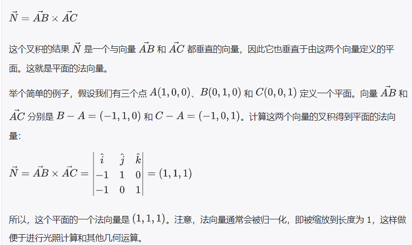
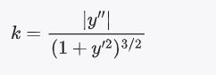
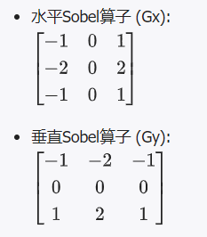

#### 法向量
    法向量就是一个指向直线、平面或曲面“垂直”方向的箭头
    在三维空间中，对于一个具体的点，法向量描述了该点所在表面的朝向

 - 为什么需要法向量
   在三维图形和模型中，每个面都有它特定的朝向。了解这些面的朝向是非常重要的，因为这决定了它们如何反射光线，从而影响到我们看到的颜色和明暗。法向量就是用来表示这些面朝向的向量。
  - 法向量的表示
   在计算机中，法向量通常表示为一个有方向的三元组（x, y, z），描述了向量在三维空间中的方向。在实际应用中，法向量经常被归一化，也就是将其长度标准化为1，这样处理便于进行计算和比较。

 - 法向量计算：
   对于一个**平面**，法向量可以通过计算平面上任意两个非平行向量的叉积来得到。叉积的结果是一个垂直于这两个向量所在平面的向量，也就是该平面的法向量。
   

   对于**曲面**，比如一个不规则的三维物体表面，法向量通常是通过计算表面上某一点附近点的几何关系得到的。考虑到曲面在每一点的朝向可能都不一样，所以每一个点都有其独特的法向量。基本原理仍然是找到一个垂直于曲面在该点处的切平面的向量。
   
   > 使用相邻点
   对于由多个三角形或多边形网格组成的曲面（这是计算机图形学中常见的表示方法），可以通过考虑与目标点相邻的顶点来估算该点的法向量。具体方法如下：
   1.平均法向量：
     **找到相邻顶点**：确定与目标点相连的所有其他顶点，这些点通常是与目标点共边的三角形或多边形的顶点。
     **计算每个面的法向量**：对于通过目标点的每个三角形（或多边形），计算该面的法向量。这可以通过计算两个非平行边的叉积来完成。
     **平均法向量**：将这些面的法向量加在一起，然后对结果进行归一化（即除以其长度），得到目标点的估算法向量。
   2.最小二乘法：
    **收集数据点**：选取目标点周围的一组点
    **构建矩阵**：使用这些点的坐标构建一个矩阵，通常是每个点一行，列分别对应x,y,z坐标
    **通过最小二乘法求解线性方程组**：找到最佳拟合平面的参数，具体来说，是寻找一个平面ax+by+cz+d = 0,使得所有的选取点到这个平面的距离的平方和最小
    **计算法向量**：一旦求得平面方程，其法向量即为方向向量（a,b,c）.
    
   > 法向量估计：无法精确计算法向量时，法向量通过估计方法近似，称作法向量估计

#### 曲率和曲率估计
   描述曲线，曲面的弯曲程度
   曲率估计是无法精确计算时，通过解析方法近似，称为曲率估计

   - 曲率的计算：
   >曲线的曲率：：对于二维平面上的曲线，其在某一点的曲率k可以定义为该点处单位切向量关于弧长的变化率。
   

   >曲面的曲率：基于法向量的变化程度
   **思路**：在一个给定的点周围选择一个小的邻域，计算邻域内所有点的法向量。然后，分析这些法向量之间的变化程度。法向量的变化程度较大意味着曲率较高，因为这表示表面在这一区域内弯曲较多。
   **实现**：可以通过计算给定点的法向量与其邻域内点的法向量之间的角度差来量化变化程度。这些角度差的平均值或最大值可以作为曲率的一个估计。

#### 梯度和曲率
   梯度侧重于二维空间中的变化率，而曲率关注三维空间中的形状变化
   1.二维图像的梯度计算：及亮度（灰度级或者颜色强度）的变化。可以用来识别物体的边缘，这里只讲sobel算子：
   想象一下，你有一张模糊的照片，想要找出照片中物体的轮廓，sobel算子就像一个特殊的放大镜，能帮你看清楚这些轮廓在哪里
   a.分两步看，首先，sobel算子分别看水平和垂直方向上的变化，可以想象成先用放大镜从左到右扫一遍，再从上到下扫一遍
   b.判断明暗变化，当从左到右扫描时，sobel算子注意的是每个点旁边的点是变亮了还是变暗了，变化越大，说明这里越可能是物体的边缘
   c.具体操作：sobel算子是通过数学上的卷积来实现的，它有两个小方格（卷积核），一个用来看横向变化，一个用来看纵向变化，这两个小方格分别套在照片的每个点上，根据周围的明暗计算出这个点的变化情况（强度和方向），强度大的地方就是轮廓线所在的地方，这个地方就是**梯度的峰值**。
   

#### 八叉树和K-D树
   **八叉树** ：想象一个不断分割的大盒子，每次都分割成八个等份，不断向下分成更多更小的八个等份，用来管理三维空间中的对象，让查找和管理变得更加高效
   **K-D树** ：按照维度循环分割，每次分割都基于不同的维度（特点），让你能够更有条理、更快速地找到你想要的东西。
   a.划分第一步（流派分割）：首先，你决定按照“流派”这个维度来切分你的音乐库，将歌曲分成摇滚、爵士、流行等不同的大类。
   b.划分第二步（年份分割）：然后，在每个流派的分类里，你再按照“发行年份”这个维度来切分，比如将摇滚类进一步划分为“80年代摇滚”、“90年代摇滚”、“21世纪摇滚”等。
   c.循环分割：如果需要，你可以继续按其他维度进行分割，比如“节奏快慢”、“歌曲情绪”等，每次分割都让分类更细，帮助你更快地找到想听的歌。

##### 3D线激光相机的硬件特征
   **多波长激光**:就像一盒多色彩蜡笔，能在特定的应用中提供不同颜色（波长）的光。
   **多源照明**：房间里的多盏灯，从多个角度照亮物体，减少阴影，提高清晰度
   **增强型传感器**：像佩戴了高级眼镜的眼睛，能看得更远，更清晰。

#### 刚性变换和仿射变换
    刚性变换仅包括旋转和平移，仿射变换的范畴更大，还包括缩放和倾斜
在3D建模和动画中，仿射变换矩阵用来执行和表示物体在三维空间中的变换，包括平移，旋转，缩放和倾斜（切变）。这些变换可以单独使用，也可以组合使用，以创建更复杂的动画和场景。
    *平移（Translation）:移动对象在空间中的位置
    [ 1  0  0  tx ]
    [ 0  1  0  ty ]
    [ 0  0  1  tz ]
    [ 0  0  0  1  ]    
    其中，tx,ty,tz,分别是眼x,y,z轴平移的距离

    *旋转（Rotation）：围绕一个轴或任意方向旋转对象，
    [ cos(θ)  -sin(θ)  0  0 ]
    [ sin(θ)   cos(θ)  0  0 ]
    [   0         0     1  0 ]
    [   0         0     0  1 ]   
    绕z轴旋转的矩阵，旋转角度0
    第一行 [ cos(θ) -sin(θ) 0 0 ] 和第二行 [ sin(θ) cos(θ) 0 0 ] 一起定义了XY平面上的旋转，其中 θ 是旋转角度。cos(θ) 和 sin(θ) 是标准三角函数，它们代表了旋转的方向和大小。
    cos(θ) 代表X轴旋转后在自身轴上的分量，而 -sin(θ) 代表X轴旋转到Y轴上的分量。
    sin(θ) 代表Y轴旋转到X轴上的分量，而 cos(θ) 代表Y轴旋转后在自身轴上的分量。
    第三行 [ 0 0 1 0 ] 表示Z轴的坐标保持不变（因为1是Z轴的乘子），旋转仅发生在XY平面内。
    第四行 [ 0 0 0 1 ] 是齐次坐标部分，它保持了变换的仿射性质并允许变换能够通过矩阵乘法串联。
    应用这个旋转矩阵到一个点 (x, y, z, 1) 上，我们可以得到绕Z轴旋转后点的新坐标 (x', y', z', 1)：
    x' = x * cos(θ) - y * sin(θ)
    y' = x * sin(θ) + y * cos(θ)
    z' = z
    点的X，Y，坐标根据旋转角度发生改变，Z坐标保持不变，该变换通常用于图形学，机器人学和任何需要绕Z轴旋转的场景，旋转方向遵循右手准则，从Z轴正向看，逆时针旋转为正角度。   

    *缩放（Scaling）：改变对象的大小
    [ sx  0   0  0 ]
    [ 0   sy  0  0 ]
    [ 0   0   sz 0 ]
    [ 0   0   0  1 ] 
    缩放矩阵，其中的sx,sy,sz分别是沿x,y,z轴的缩放因子

    *倾斜（Shearing）:沿一个轴向另一个轴倾斜物体，它沿一个或多个轴方向拉伸或压缩对象，而不改变在切变平面上的坐标
    [ 1  shx shy  0 ]
    [ 0   1   0   0 ]
    [ 0  0    1   0 ]
    [ 0  0    0   1 ]  
    第一行 1 shx  shy 0 表示X轴的坐标保持不变（1是X轴的乘子），而Y轴和Z轴的坐标对X轴的坐标有影响，shx是X轴相对于Y轴的的切变因子， shy是X轴相对于Z轴的切变因子 
    第二行表示Y轴坐标不变（1是Y轴的乘子），且不受其他坐标的影响
    第三行表示Z轴坐标不变（1是Z轴的乘子），且不受其他坐标的影响 
    第四行0 0 0 1 用于保持变换的线性，并允许使用矩阵乘法应用多个变换
    通过这个变换：空间中的点在变换之后的位置为：
    x' = x + y * shx + z * shy
    y' = y
    z' = z
    Y,Z轴坐标不变，而X坐标根据Y和Z坐标以及相应的切变因子调整，在图形的几何变换中很有用。

    * 组合变换
      通过将仿射变换矩阵用矩阵乘法相乘组合，乘法顺序会影响最终结果

    *应用到3D模型，将这些变换应用到3D模型的顶点上，得到变换

     使用仿射变换矩阵的优势在于它们保持了几何结构的直线和平面特性，同时可以使用矩阵运算简化变换过程。

### 仿射变换中的齐次坐标
     齐次坐标在仿射变换矩阵中是必要的，因为齐次坐标使得我们以统一的方式表示平移，旋转缩放和其他线性变换以及它们的组合，
     1.允许平移变换。没有齐次坐标，无法平移变换
     在三维空间中，一个点表示为（x,y,z），引入齐次坐标是，添加了一个额外的维度w
     这时点被描述为（x,y,z,w），w通常设置为1
     在平移变换中，
     [ 1  0  0  tx ]
     [ 0  1  0  ty ]
     [ 0  0  1  tz ]
     [ 0  0  0  1  ]
     只有引入w，平移值tx,ty,tz才能在变换中应用

     2.实现多个仿射变换的组合：
     使用齐次坐标，可以通过简单的矩阵乘法来组合多个变换，如可以将旋转矩阵，平移矩阵，缩放矩阵等变换矩阵相乘，合并成一个单一的矩阵，一次性应用到空间点上。

     3.维持仿射变换的线性，齐次坐标使得所有的过程变换都维持线性，这意味着变换可逆，可以组合，且遵循矩阵乘法的结合律

     4.在计算机图形学和机器视觉中，使用齐次坐标可以简化计算，用统一的数学表达式和计算方法进行处理

     5.在三维图形渲染中，使用齐次坐标可以方便的表示透视投影，在透视投影变换中，w坐标用于深度出发，这样远离观察者的物体看起来会更小

   **为什么齐次坐标中的w坐标通常设置为1**
       这样设置允许将三维空间中的点（x,y,z）无缝地嵌入四维齐次空间中，同时保持了原有的笛卡尔坐标系中的位置信息
       1.保持坐标一致性：当 w 设为1时，齐次坐标 (x, y, z, 1) 中的前三个坐标 (x, y, z) 直接对应于笛卡尔坐标系中的点。这意味着除了 w 坐标外，其他坐标不需要进行缩放或变换即可表示其在三维空间中的位置
       2.简化仿射变换：一个平移变换可以通过一个简单的矩阵乘法来实现，而不需要对 (x, y, z) 进行额外的加法操作
       3.方便求逆变换和矩阵乘法：计算其逆矩阵，并将其应用于变换后的点，以恢复原始的点坐标

#### 卷积神经网络，图卷积神经网络
   GCN通过观察点与点之间的相互关系来学习每个点的特性，具体来说，GCN会对每个点收集其邻居点的信息。它会考虑这个点和它周围点的特性，然后通过一种特殊的计算方法来"混合"这些信息。这样，每个点的新特性就不仅仅是它自己的信息，还包括了它的邻居们的信息 
   可以把GCN想象成一个在聚会上的**超级社交达人**。这个社交达人想要了解聚会上每个人的兴趣爱好，但是他不会只和每个人独立聊天。他会观察大家是如何互动的，比如谁和谁是朋友，谁经常一起出去玩，这样他就能更好地理解每个人的性格和兴趣。 在点云的世界里，每个点就像聚会上的一个人。点云可以被看作是一个大网络，或者说是一张图，每个点都可能和其他点有联系（比如两个点很接近，或者在数学上有某种关系）。GCN就是那个能够理解这张复杂“社交网络”的达人。它通过看点与点之间的关系来学习每个点的特性，然后用这些信息来完成复杂的任务，比如识别物体或者帮助自动驾驶汽车理解它们周围的环境。
   简单来说，GCN就是一个很擅长看图的算法，它能够理解和分析点云数据中各个点之间的复杂关系。通过这种方式，GCN帮助计算机更好地认识和处理三维空间中的点云数据。

#### 聚类算法 
    1.聚类算法：一种机器学习技术，用来把一堆数据“分成几堆”。每一“堆”里的数据是相似的，而不同“堆”之间的数据则是不同的
   **例子**：
    假设你有一大堆图钉，有红色的、蓝色的和绿色的。你想把这些图钉按颜色分成几堆。这时候，你可以用聚类算法来帮你完成这件事。
    - 输入：一大堆混在一起的图钉。
    - 过程：聚类算法根据图钉的颜色把它们分成几堆。
    - 输出：一堆红色图钉、一堆蓝色图钉和一堆绿色图钉。
  **具体步骤**:
    a.初始化：随机选择几个点作为“中心”，比如选三个点作为三个颜色的代表。
    b.分配数据：把每个图钉分配到离它最近的“中心”那一堆。
    c.更新中心：重新计算每一堆的中心，也就是计算每堆图钉的颜色平均值作为新的中心。
    d.重复分配和更新：继续把图钉分配到更新后的中心，直到分配结果不再变化

#### K-均值聚类（K-Means）
   K-均值聚类算法是一种常用的聚类方法，它的目的是把一堆数据分成K个组，每个组里的数据点彼此之间比较相似，而不同组之间的数据点差别较大。
   **具体步骤**:
  1. 选择初始中心点
    首先，你要决定分成几组（K个组）。然后随机选K个数据点，作为每组的“初始中心点”。
  2. 分配数据点
    把每个数据点分配到离它最近的中心点所属的组里。这样，每个数据点都会被归类到一个组中。
  3. 重新计算中心点
    每个组里的数据点可能会改变原来组的中心点位置。于是，计算每个组内所有数据点的平均值，这个平均值就是新的中心点。
  4. 重复步骤2和3
    使用新的中心点，重复步骤2和3，直到每个数据点所在的组不再变化，或者变化非常小。这个过程可能会重复几次，直到达到稳定状态。

  - 例子:
  假设你有一大堆不同颜色的球，你想把这些球分成红色、绿色和蓝色三组。
  A.初始步骤:
    1. 选择3个球，假设一个红色的、一个绿色的、一个蓝色的，作为初始中心点。
    2. 把每个球分配到离它颜色最接近的初始中心点那组。
    3. 计算每组球的平均颜色，得到新的中心点。
  B.迭代步骤:
    4. 用新的中心点重新分配所有球。
    5. 再次计算每组球的平均颜色，得到新的中心点。
    6. 重复分配和计算，直到球的分配不再变化。
    最终，每组球的颜色会非常接近，这就是K-均值聚类完成的结果。
    K-均值聚类算法就是通过不断调整和重新分配数据点（比如颜色、位置等），最终把数据点分成K个组。

#### 体素栅格化
   三维点云数据中的体素栅格化是指将三维空间划分为一系列规则的立方体（体素），并将点云数据映射到这些体素中。每个体素可以包含一个或多个点云数据点，通过这种方式，可以将复杂的三维点云数据简化为更易于处理和分析的体素网格。
    1. **空间划分**：将三维空间划分为大小相等的立方体（体素）。
    2. **点云映射**：将点云数据中的每个点映射到对应的体素中。
    3. **数据处理**：对每个体素中的点进行处理，例如计算平均值、最大值、最小值等。
    - 优点：
    - **数据简化**：将复杂的点云数据简化为规则的体素网格，便于后续处理和分析。
    - **空间索引**：通过体素网格可以快速定位和检索点云数据，提高处理效率。
    - **数据压缩**：体素栅格化可以减少数据量，降低存储和计算成本。

