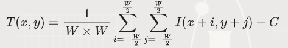
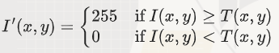

*普通阈值分割*是指使用一个全局的阈值将图像分为前景和背景。这个阈值是固定的，对整个图像都适用。

- 假设我们有一张灰度图像，我们选择一个阈值 T。
- 如果一个像素的灰度值大于或等于 T，我们将它设为白色（前景）。
- 如果一个像素的灰度值小于 T，我们将它设为黑色（背景）。

这种方法在图像的亮度均匀时效果很好，但在图像有阴影或光照不均匀时效果就不好了。

**自适应阈值分割**是指根据图像的局部区域动态地确定阈值。每个像素的阈值是根据它周围的像素计算出来的，因此可以更好地处理光照不均匀的问题。

- 假设我们有一张灰度图像，我们选择一个窗口大小 W 和一个常数 C。
- 对于每个像素，我们计算它周围 W * W 窗口内的平均值或中值，然后减去常数 C 作为该像素的阈值。
- 如果一个像素的灰度值大于或等于这个动态阈值，我们将它设为白色（前景）。
- 如果一个像素的灰度值小于这个动态阈值，我们将它设为黑色（背景）。

- 自适应阈值分割是普通阈值分割的改进版，能够更好地处理光照不均匀的问题。

#### 数学逻辑

自适应阈值分割的数学公式如下：

1. *局部平均值*：

  

   其中，W 是窗口大小，I(x, y) 是像素的灰度值，C 是常数。

2. *分割公式*：

  
 

#### 代码实现

```cpp
#include <iostream>
#include <opencv2/opencv.hpp>

// 自适应阈值分割
cv::Mat adaptiveThreshold(const cv::Mat& src, int windowSize, int C) {
    cv::Mat dst = cv::Mat::zeros(src.size(), CV_8U);
    int halfWindowSize = windowSize / 2;

    for (int y = 0; y < src.rows; ++y) {
        for (int x = 0; x < src.cols; ++x) {
            int sum = 0;
            int count = 0;

            for (int j = -halfWindowSize; j <= halfWindowSize; ++j) {
                for (int i = -halfWindowSize; i <= halfWindowSize; ++i) {
                    int ny = y + j;
                    int nx = x + i;

                    if (ny >= 0 && ny < src.rows && nx >= 0 && nx < src.cols) {
                        sum += src.at<uchar>(ny, nx);
                        ++count;
                    }
                }
            }

            int localThreshold = sum / count - C;

            if (src.at<uchar>(y, x) >= localThreshold) {
                dst.at<uchar>(y, x) = 255;
            } else {
                dst.at<uchar>(y, x) = 0;
            }
        }
    }

    return dst;
}

int main() {
    // 从文件加载灰度图像
    cv::Mat img = cv::imread("input.jpg", cv::IMREAD_GRAYSCALE);
    if (img.empty()) {
        std::cerr << "Error: Could not open or find the image." << std::endl;
        return -1;
    }

    // 自适应阈值分割
    int windowSize = 15; // 窗口大小
    int C = 10; // 常数
    cv::Mat adaptiveThreshImg = adaptiveThreshold(img, windowSize, C);

    // 保存和显示结果图像
    cv::imwrite("adaptive_threshold.jpg", adaptiveThreshImg);
    cv::imshow("Adaptive Threshold", adaptiveThreshImg);
    cv::waitKey(0);

    return 0;
}
```

#### 代码解释

自适应阈值分割：
   - `adaptiveThreshold` 函数遍历图像中的每个像素，计算其周围窗口内的平均值减去常数 C作为该像素的局部阈值。
   - 如果像素的灰度值大于或等于这个局部阈值，则将该像素设为255（白色）；否则设为0（黑色）。

