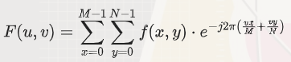

傅里叶变换是一种数学方法，它可以将一个信号（例如图像）从空间域转换到频率域。<br>
简单来说，它可以帮助我们分析图像中不同频率的成分，就像把一首乐曲分解成各种音调一样。<br>

##### 二维离散傅里叶变换（DFT）

对于一个大小为M *N 的图像 f(x,y) ，其二维离散傅里叶变换 F(u,v) 定义为：<br>

  

其中，u,v是频率坐标，j是虚数单位 <br>

##### 为什么要用傅里叶变换？

在图像处理中，傅里叶变换有很多应用，比如去除噪声、增强图像细节、进行图像压缩等等。<br>
通过傅里叶变换，我们可以更容易地处理和分析图像中的频率信息。<br>
想象一下，我们有一张灰度图像，每个像素的亮度值表示图像的灰度。<br>
傅里叶变换就像是把这张图像看作是由许多不同频率的正弦波和余弦波叠加而成的。<br>
通过傅里叶变换，我们可以找出这些不同频率的波是什么样子的。<br>

##### 傅里叶变换的步骤

1. *输入图像*：我们从一张灰度图像开始。<br>
2. *计算频率成分*：傅里叶变换会计算出图像中每个频率成分的强度和相位。这些频率成分告诉我们图像中有哪些“波”。<br>
3. *频域图像*：结果是一个频域图像，显示了不同频率成分的强度。<br>
     高频成分表示图像中的快速变化（如边缘），低频成分表示图像中的慢速变化（如平滑区域）。


##### 通俗总结

1. *图像是由波组成的*：傅里叶变换认为图像是由许多不同频率的波组成的。<br>
2. *找出这些波*：傅里叶变换帮助我们找出这些不同频率的波是什么样子的。<br>
3. *分析和处理*：通过分析这些波，我们可以更容易地处理图像，例如去除噪声或增强细节。<br>

##### 代码实现

```cpp
#include <iostream>
#include <opencv2/opencv.hpp>
#include <complex>
#include <vector>
#include <cmath>

using namespace std;

// 计算二维离散傅里叶变换（DFT）
vector<vector<complex<double>>> computeDFT(const cv::Mat& src) 
{
    int M = src.rows;
    int N = src.cols;
    vector<vector<complex<double>>> dftResult(M, vector<complex<double>>(N));

    for (int u = 0; u < M; ++u) 
    {
        for (int v = 0; v < N; ++v) 
        {
            complex<double> sum(0.0, 0.0);
            for (int x = 0; x < M; ++x) 
            {
                for (int y = 0; y < N; ++y) 
                {
                    double angle = -2.0 * M_PI * ((u * x / double(M)) + (v * y / double(N)));
                    complex<double> expTerm(cos(angle), sin(angle));
                    sum += src.at<uchar>(x, y) * expTerm;
                }
            }
            dftResult[u][v] = sum;
        }
    }

    return dftResult;
}

// 计算二维离散傅里叶逆变换（IDFT）
cv::Mat computeIDFT(const vector<vector<complex<double>>>& dftResult) 
{
    int M = dftResult.size();
    int N = dftResult[0].size();
    cv::Mat idftResult(M, N, CV_64F);

    for (int x = 0; x < M; ++x) 
    {
        for (int y = 0; y < N; ++y) 
        {
            complex<double> sum(0.0, 0.0);
            for (int u = 0; u < M; ++u) 
            {
                for (int v = 0; v < N; ++v) 
                {
                    double angle = 2.0 * M_PI * ((u * x / double(M)) + (v * y / double(N)));
                    complex<double> expTerm(cos(angle), sin(angle));
                    sum += dftResult[u][v] * expTerm;
                }
            }
            idftResult.at<double>(x, y) = abs(sum) / (M * N);
        }
    }

    return idftResult;
}

// 计算幅值图像
cv::Mat computeMagnitude(const vector<vector<complex<double>>>& dftResult) 
{
    int M = dftResult.size();
    int N = dftResult[0].size();
    cv::Mat magI(M, N, CV_64F);

    for (int u = 0; u < M; ++u) 
    {
        for (int v = 0; v < N; ++v) 
        {
            magI.at<double>(u, v) = log(1 + abs(dftResult[u][v]));
        }
    }

    return magI;
}

// 重排傅里叶图像中的象限
void shiftQuadrants(cv::Mat& magI) 
{
    magI = magI(cv::Rect(0, 0, magI.cols & -2, magI.rows & -2));
    int cx = magI.cols / 2;
    int cy = magI.rows / 2;

    cv::Mat q0(magI, cv::Rect(0, 0, cx, cy));
    cv::Mat q1(magI, cv::Rect(cx, 0, cx, cy));
    cv::Mat q2(magI, cv::Rect(0, cy, cx, cy));
    cv::Mat q3(magI, cv::Rect(cx, cy, cx, cy));

    cv::Mat tmp;
    q0.copyTo(tmp);
    q3.copyTo(q0);
    tmp.copyTo(q3);

    q1.copyTo(tmp);
    q2.copyTo(q1);
    tmp.copyTo(q2);
}

int main() 
{
    // 从文件加载灰度图像
    cv::Mat img = cv::imread("input.jpg", cv::IMREAD_GRAYSCALE);
    if (img.empty()) 
    {
        cerr << "Error: Could not open or find the image." << endl;
        return -1;
    }

    // 计算二维离散傅里叶变换（DFT）
    vector<vector<complex<double>>> dftResult = computeDFT(img);

    // 计算幅值图像
    cv::Mat magI = computeMagnitude(dftResult);

    // 重排傅里叶图像中的象限
    shiftQuadrants(magI);

    // 归一化幅值图像
    cv::normalize(magI, magI, 0, 1, cv::NORM_MINMAX);

    // 显示结果
    cv::imshow("Input Image", img);
    cv::imshow("Spectrum Magnitude", magI);

    // 计算二维离散傅里叶逆变换（IDFT）
    cv::Mat idftResult = computeIDFT(dftResult);
    cv::normalize(idftResult, idftResult, 0, 1, cv::NORM_MINMAX);
    cv::imshow("IDFT Result", idftResult);

    cv::waitKey(0);

    return 0;
}
```

#### 代码解释

1. 计算二维离散傅里叶变换（DFT）：<br>
computeDFT 函数遍历图像的每个频率坐标 ，计算每个频率分量的复数值。<br>
公式中的指数项使用 cos 和 sin 函数计算。<br>

2. 计算二维离散傅里叶逆变换（IDFT）：<br>
computeIDFT 函数遍历图像的每个空间坐标 ，计算每个像素的重建值。<br>
公式中的指数项使用 cos 和 sin 函数计算，并对结果进行归一化。<br>

3. 计算幅值图像：<br>
computeMagnitude 函数计算傅里叶变换结果的幅值图像，并进行对数变换以便于显示。<br>

4. 重排傅里叶图像中的象限：<br>
shiftQuadrants 函数将幅值图像的象限重排，以便于观察频谱中心。<br>