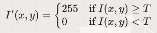
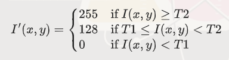

阈值分割是一种简单而有效的图像分割方法。其基本思想是通过设定一个或多个阈值，<br>
将图像像素分为不同的类别（通常是前景和背景）。<br>

#### 数学步骤

1. *单阈值分割*：<br>

   - 对于每个像素，比较其灰度值与阈值。如果灰度值大于阈值，则将该像素归为前景；否则归为背景。<br>
   - 数学公式：<br>

    

   - 其中，I(x, y) 是原始图像的灰度值，I'(x, y) 是分割后的图像，T 是阈值。<br>

2. *多阈值分割*：<br>
   - 将图像分割成多个类别，每个类别对应一个阈值范围。<br>
   - 数学公式（假设有两个阈值 T1 和 T2）：<br>

    

#### 应用场景

1. 二值化处理<br>
应用场景：文档图像处理<br>
解释：在扫描文档时，我们希望将文字和背景区分开来。通过阈值分割，我们可以将图像中灰<br>
度值高于某个阈值的像素设为白色，低于该阈值的像素设为黑色，从而实现文档的二值化处理。这有助于提高文字识别（OCR）的准确性。

2. 目标检测<br>
应用场景：工业视觉检测<br>
解释：在工业生产中，我们需要检测产品上的缺陷或标记。<br>
通过阈值分割，我们可以将图像中的目标区域与背景区分开来。<br>
例如，在检测印刷电路板（PCB）上的缺陷时，可以通过阈值分割将铜线和基板区分开来，<br>
从而更容易检测到断线、短路等缺陷。

3. 分割前景和背景<br>
应用场景：医学图像处理<br>
解释：在医学图像处理中，我们需要从复杂的背景中提取出感兴趣的区域（如肿瘤、器官等）。<br>
通过阈值分割，可以将图像中的前景（如肿瘤）与背景（如正常组织）区分开来，从而更容易进行后续的分析和诊断。

4. 车牌识别<br>
应用场景：智能交通系统<br>
解释：在车牌识别系统中，我们需要从车辆图像中提取出车牌区域。<br>
通过阈值分割，可以将车牌字符与背景区分开来，从而提高字符识别的准确性。<br>

5. 人脸检测<br>
应用场景：安全监控<br>
解释：在安全监控系统中，我们需要检测并识别人脸。<br>
通过阈值分割，可以将人脸区域与背景区分开来，从而提高人脸检测和识别的准确性。


#### 代码实现

以下是一个完整的C++代码示例，实现了单阈值分割和多阈值分割。我们将使用图像像素点遍历的方式来实现。

```cpp
#include <iostream>
#include <opencv2/opencv.hpp>

// 单阈值分割
cv::Mat singleThreshold(const cv::Mat& src, int threshold) 
{
    cv::Mat dst = cv::Mat::zeros(src.size(), CV_8U);
    for (int y = 0; y < src.rows; ++y) 
    {
        for (int x = 0; x < src.cols; ++x) 
        {
            if (src.at<uchar>(y, x) >= threshold) 
            {
                dst.at<uchar>(y, x) = 255;
            }
            else 
            {
                dst.at<uchar>(y, x) = 0;
            }
        }
    }
    return dst;
}

// 多阈值分割
cv::Mat multiThreshold(const cv::Mat& src, int threshold1, int threshold2) 
{
    cv::Mat dst = cv::Mat::zeros(src.size(), CV_8U);
    for (int y = 0; y < src.rows; ++y) 
    {
        for (int x = 0; x < src.cols; ++x) 
        {
            if (src.at<uchar>(y, x) >= threshold2) 
            {
                dst.at<uchar>(y, x) = 255;
            }
            else if (src.at<uchar>(y, x) >= threshold1) 
            {
                dst.at<uchar>(y, x) = 128;
            } 
            else 
            {
                dst.at<uchar>(y, x) = 0;
            }
        }
    }
    return dst;
}

int main() 
{
    // 从文件加载灰度图像
    cv::Mat img = cv::imread("input.jpg", cv::IMREAD_GRAYSCALE);
    if (img.empty()) 
    {
        std::cerr << "Error: Could not open or find the image." << std::endl;
        return -1;
    }

    // 单阈值分割
    int threshold = 128;
    cv::Mat singleThreshImg = singleThreshold(img, threshold);

    // 多阈值分割
    int threshold1 = 85;
    int threshold2 = 170;
    cv::Mat multiThreshImg = multiThreshold(img, threshold1, threshold2);

    // 保存和显示结果图像
    cv::imwrite("single_threshold.jpg", singleThreshImg);
    cv::imwrite("multi_threshold.jpg", multiThreshImg);
    cv::imshow("Single Threshold", singleThreshImg);
    cv::imshow("Multi Threshold", multiThreshImg);
    cv::waitKey(0);

    return 0;
}
```

#### 代码解释

1. *单阈值分割*：<br>
   - `singleThreshold` 函数遍历图像中的每个像素，比较其灰度值与阈值。<br>
   如果灰度值大于或等于阈值，则将该像素设为255（白色）；否则设为0（黑色）。

2. *多阈值分割*：
   - `multiThreshold` 函数遍历图像中的每个像素，比较其灰度值与两个阈值。<br>
   如果灰度值大于或等于高阈值，则将该像素设为255（白色）；<br>
   如果介于两个阈值之间，则设为128（灰色）；否则设为0（黑色）。
