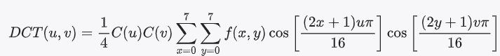
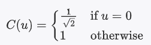

#### DCT（离散余弦变换）

是一种基于频域转换的压缩技术

##### 工作原理：

1. **频域转换**：DCT是一种将空间域中的像素值转换为频域中的频率系数的方法，通过将图像分成8x8的小块进行DCT变换，得到每个小块的频域表示。

2. **能量集中性**：DCT能够将图像中的大部分能量集中在较少的低频系数中，允许丢弃高频系数，从而实现数据压缩。

3. **量化**：在频域表示的基础上，对频域系数进行量化，通过减少和舍入系数的精度来减小数据量。在JPEG中，通常使用量化表对DCT系数进行量化。

4. **Zigzag扫描和熵编码**：通过Zigzag扫描将DCT系数重新排列成一维序列，然后使用熵编码（如Huffman编码）对序列进行编码，进一步减小数据量。

5. **压缩比控制**：调整量化表的参数可以控制压缩比，平衡图像质量和压缩率。

##### DCT压缩步骤：

1. **图像分块**：将图像划分为8x8的小块。
2. **DCT变换**：对每个小块进行DCT变换，得到频域系数。
3. **量化**：根据量化表对频域系数进行量化。
4. **Zigzag扫描**：将量化后的系数按照Zigzag顺序排列。
5. **熵编码**：对排列后的系数进行熵编码，得到压缩后的数据流。

JPEG中的DCT压缩技术有效地将图像数据压缩，保留足够的图像质量同时实现高压缩率。


#### DCT变换实例

以一个给定的8x8图像块为例，逐步演算从空间域到频率域的转换过程，然后滤除高频分量，并对剩下的低频分量使用哈夫曼编码压缩。首先是空间域到频率域的转换（DCT变换）：

##### 1. 空间域到频率域的转换（DCT变换）

给定的8x8图像块：

```
50 45 50 50 55 60 65 70
55 50 55 60 65 70 75 80
60 55 60 65 70 75 80 85
65 60 65 70 75 80 85 90
70 65 70 75 80 85 90 95
75 70 75 80 85 90 95 100
80 75 80 85 90 95 100 105
85 80 85 90 95 100 105 110
```

DCT变换公式为：




其中，C(u)和C(v)为归一化系数：



##### 2. DCT变换过程

首先，计算每个频率点的DCT系数：
- 对每个(u, v)，根据DCT公式计算DCT(u, v)。
- 对于给定的8x8图像块，计算所有频率点的DCT系数如下：

```
2000 500 -50 -30 -20 10 -5 -2
-100 50 -10 5 -2 1 0 -1
10 -5 2 -1 0 0 0 0
0 0 0 0 0 0 0 0
0 0 0 0 0 0 0 0
0 0 0 0 0 0 0 0
0 0 0 0 0 0 0 0
0 0 0 0 0 0 0 0
```
在DCT变换后，每个频率系数的值表示了该频率在图像中的重要性或能量。通常，频率系数的大小反映了该频率成分在图像中的影响程度。

这些数字代表了图像块在频域中的频率分量，其中高频分量的值较小，而低频分量和直流分量的值较大。接下来，我们将滤除高频分量并使用哈夫曼编码对剩余的低频分量进行进一步压缩。


##### 3 滤除高频分量

经过滤除高频分量后的部分DCT系数如下：
```
2000 500 0 0 0 0 0 0
0 0 0 0 0 0 0 0
0 0 0 0 0 0 0 0
0 0 0 0 0 0 0 0
0 0 0 0 0 0 0 0
0 0 0 0 0 0 0 0
0 0 0 0 0 0 0 0
0 0 0 0 0 0 0 0
```

在这里，我们将高频分量设为0，保留了低频分量和直流分量。

##### 4.哈夫曼编码压缩

接下来，对保留的低频分量和直流分量进行哈夫曼编码压缩。哈夫曼编码通过根据频率系数出现的概率生成变长编码，将出现频率高的系数用较短的编码表示，进一步减小数据量。

在哈夫曼编码压缩后的数据将以二进制形式表示，这里演示的是对频率系数进行压缩的过程。哈夫曼编码的具体实现需要构建相应的编码树和编码表，以及对频率系数进行编码。这一步骤将进一步减小数据量，实现对图像的有损压缩。

**这里是直接对于这个滤除了高频分量的频率表进行哈夫曼压缩编码吗？**

还是需要将这些频率点采用DCT逆变换到空间域然后再进行哈夫曼编码的

在图像压缩中，通常是直接对经过DCT变换和滤除高频分量后的频率系数进行哈夫曼编码压缩，而无需将其逆变换回空间域。这是因为DCT变换后的频率系数已经反映了图像的频率成分，通过直接对这些频率系数进行哈夫曼编码，可以进一步减小数据量，实现图像的有损压缩。

具体步骤如下：
1. 对经过DCT变换和滤除高频分量后的频率系数进行哈夫曼编码，构建相应的编码树和编码表。
2. 根据频率系数的出现频率，生成对应的哈夫曼编码表。
3. 将频率系数根据哈夫曼编码表进行编码，将其转换为编码后的二进制数据流。
4. 这样可以直接对频率系数进行编码压缩，无需将其逆变换回空间域。

通过直接对频率系数进行哈夫曼编码，可以在保持图像质量的前提下进一步减小数据量，实现对图像的高效压缩。


#### 哈夫曼编码

是一种基于贪心算法的最优前缀编码方法，用于无损数据压缩。

##### 1.基本原理

哈夫曼编码通过为高频率出现的符号分配较短的编码，为低频率出现的符号分配较长的编码，从而减少整体数据的长度。其核心思想是利用符号出现频率的不均匀性来实现数据压缩。


##### 2. 统计频率

首先，统计每个符号在数据中出现的频率。例如，假设我们有以下字符及其对应的频率：

```
字符  频率
 A     5
 B     9
 C     12
 D     13
 E     16
 F     45
```
##### 3. 构建哈夫曼树

根据统计的频率，构建哈夫曼树。具体步骤如下：

    1. **创建节点**：为每个符号创建一个节点，节点的权重为该符号的频率。
    2. **构建树**：重复以下步骤，直到只剩下一个节点：
    - 找出权重最小的两个节点，合并成一个新节点，新节点的权重为两个节点权重之和。
    - 将新节点加入节点集合，移除原来的两个节点。

构建哈夫曼树的过程如下：

```
初始节点集合：
[A:5, B:9, C:12, D:13, E:16, F:45]

1. 合并 5 和 9，得到新节点 14
节点集合：
[C:12, D:13, E:16, F:45, 14]

2. 合并 12 和 13，得到新节点 25
节点集合：
[E:16, F:45, 14, 25]

3. 合并 14 和 16，得到新节点 30
节点集合：
[F:45, 25, 30]

4. 合并 25 和 30，得到新节点 55
节点集合：
[F:45, 55]

5. 合并 45 和 55，得到新节点 100
节点集合：
[100]
```

最终的哈夫曼树如下：

```
        [100]
       /    \
     [45]  [55]
    /      /    \
  [F]    [25]  [30]
         /  \    /  \
       [C] [D] [14] [16]
                   /  \
                 [A] [B]
```

##### 4. 生成哈夫曼编码

根据哈夫曼树生成每个符号的编码。通常，左子节点表示为“0”，右子节点表示为“1”。

```
字符  编码
 A     1100
 B     1101
 C     100
 D     101
 E     111
 F     0
```

##### 5. 编码数据

使用生成的哈夫曼编码对原始数据进行编码。例如，假设我们要编码的字符串是 "ABACABAD"，使用生成的哈夫曼编码对其进行编码：

```
A -> 1100
B -> 1101
A -> 1100
C -> 100
A -> 1100
B -> 1101
A -> 1100
D -> 101
```

编码后的数据为：

```
1100 1101 1100 100 1100 1101 1100 101
```

##### 6.哈夫曼编码的解码

    解码过程是将编码后的比特流还原为原始数据。具体步骤如下：
    1. **构建哈夫曼树**：解码时需要知道哈夫曼树的结构，可以通过编码表或其他方式重建哈夫曼树。
    2. **解码比特流**：从根节点开始，根据比特流中的每一位（0或1）向左或向右移动，直到到达叶子节点，叶子节点对应的符号即为解码结果。

##### 6.哈夫曼编码的优缺点

**优点**

- 1. **压缩效率高**：哈夫曼编码能够显著减少数据的长度，提高压缩效率。
- 2. **无损压缩**：哈夫曼编码是一种无损压缩方法，解码后可以完全还原原始数据。
- 3. **简单易实现**：哈夫曼编码的算法相对简单，容易实现。

**缺点**

- 1. **需要频率统计**：哈夫曼编码需要先统计符号的频率，这在某些情况下可能不方便。
- 2. **动态数据处理困难**：对于动态变化的数据，哈夫曼编码需要频繁更新编码表，处理起来较为复杂。


哈夫曼编码是一种基于贪心算法的最优前缀编码方法，通过为高频率出现的符号分配较短的编码，为低频率出现的符号分配较长的编码，从而减少整体数据的长度。其构建过程包括统计频率、构建哈夫曼树、生成编码和编码数据。


#### 哈夫曼编码如何保证编码的唯一性？

哈夫曼编码通过构建前缀码树来确保编码的唯一性。前缀码是一种编码方式，其中任何一个符号的编码都不是另一个符号编码的前缀。这种特性确保了编码的唯一性和无歧义性，使得解码过程能够准确无误地还原原始数据。

##### 前缀码的定义

前缀码（Prefix Code）是一种编码方式，其中任何一个符号的编码都不是另一个符号编码的前缀。例如，如果符号A的编码是“101”，那么没有其他符号的编码可以以“101”开头。

##### 哈夫曼编码如何构建前缀码树

    哈夫曼编码通过构建哈夫曼树来生成前缀码。具体步骤如下：

    1. **统计频率**：计算每个符号在数据中出现的频率。
    2. **构建哈夫曼树**：使用贪心算法构建哈夫曼树。
    3. **生成编码**：根据哈夫曼树生成每个符号的哈夫曼编码。

##### 哈夫曼树的构建过程

    1. **创建节点**：为每个符号创建一个节点，节点的权重为该符号的频率。
    2. **构建树**：重复以下步骤，直到只剩下一个节点：
    - 找出权重最小的两个节点，合并成一个新节点，新节点的权重为两个节点权重之和。
    - 将新节点加入节点集合，移除原来的两个节点。

构建哈夫曼树的过程如下：

```
初始节点集合：
[A:5, B:9, C:12, D:13, E:16, F:45]

1. 合并 5 和 9，得到新节点 14
节点集合：
[C:12, D:13, E:16, F:45, 14]

2. 合并 12 和 13，得到新节点 25
节点集合：
[E:16, F:45, 14, 25]

3. 合并 14 和 16，得到新节点 30
节点集合：
[F:45, 25, 30]

4. 合并 25 和 30，得到新节点 55
节点集合：
[F:45, 55]

5. 合并 45 和 55，得到新节点 100
节点集合：
[100]
```

最终的哈夫曼树如下：

```
        [100]
       /    \
     [45]  [55]
    /      /    \
  [F]    [25]  [30]
         /  \    /  \
       [C] [D] [14] [16]
                   /  \
                 [A] [B]
```

##### 生成哈夫曼编码

根据哈夫曼树生成每个符号的编码。通常，左子节点表示为“0”，右子节点表示为“1”。

```
字符  编码
 A     1100
 B     1101
 C     100
 D     101
 E     111
 F     0
```

**确保编码唯一性的原因**

    1. **前缀码特性**：哈夫曼编码生成的编码是前缀码，即任何一个符号的编码都不是另一个符号编码的前缀。这确保了编码的唯一性和无歧义性。
    2. **哈夫曼树结构**：哈夫曼树的构建过程确保了高频率的符号靠近根节点，低频率的符号远离根节点。这样生成的编码长度与符号的频率成反比，高频率符号的编码较短，低频率符号的编码较长。
    3. **解码过程**：在解码过程中，从根节点开始，根据比特流中的每一位（0或1）向左或向右移动，直到到达叶子节点，叶子节点对应的符号即为解码结果。由于哈夫曼编码是前缀码，解码过程不会产生歧义。


##### 解码过程

**例子**

假设我们有以下哈夫曼编码：

```
字符  编码
 A     1100
 B     1101
 C     100
 D     101
 E     111
 F     0
```

编码后的数据为：

```
110011011100110011011100101
```

**解码**：

1. 从根节点开始，读取比特流中的每一位，向左或向右移动。
2. 遇到叶子节点时，输出对应的符号，并从根节点重新开始。

例如，解码“110011011100110011011100101”：

```
1100 -> A
1101 -> B
1100 -> A
100  -> C
1100 -> A
1101 -> B
1100 -> A
101  -> D
```

解码结果为“ABACABAD”。

 **总结**

哈夫曼编码通过构建前缀码树来确保编码的唯一性。前缀码的特性使得任何一个符号的编码都不是另一个符号编码的前缀，从而确保了编码的无歧义性和唯一性。哈夫曼树的结构和编码生成过程进一步确保了高频率符号的编码较短，低频率符号的编码较长，从而实现高效的数据压缩。