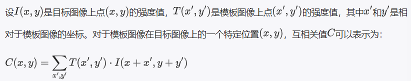
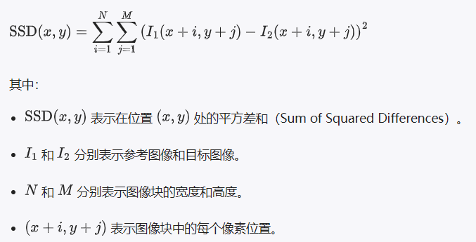
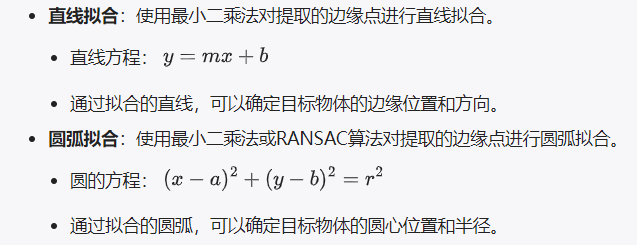

### 模板匹配
模板匹配是一种在更大图像中寻找和识别小图像（模板）位置的计算机视觉技术。
基本思想：在目标图像中寻找与模板图像最匹配的区域，通过在目标图像上滑动模板图像，并在每个位置计算模板图像和目标图像的相似度来实现
相似度：通过一些数学公式来计算，比如互相关（cross-correlation）、平方差（squared differences）等。
场景：固定背景，特征明显，光照环境稳定

1. **选择模板图像**：从原图中截取一小块作为模板。这个模板应该是你想在目标图像中寻找的物体。

2. **滑动模板**：将模板图像在目标图像上从左到右、从上到下滑动，每次移动一定的步长。

3. **计算相似度**：在每一个位置，计算模板图像和它覆盖的目标图像区域之间的相似度。

4. **确定最佳匹配位置**：所有的相似度计算完成后，选择相似度最高的位置作为模板图像在目标图像中的匹配位置。
模板匹配是一种相对简单直观的图像识别方法，但它对于光照、旋转和尺度变化比较敏感。对于更复杂的应用场景，可能需要配合其他的图像处理和机器学习技术来提高匹配的准确性和鲁棒性。

#### 匹配算法
   
 **互相关匹配**
通过计算模板图像与目标图像的互相关系数：
1.遍历目标图像：将模板图像按照顺序滑动覆盖目标图像的每一个可能的位置
2.对于每一个位置，计算模板图像和目标图像覆盖区域之间的像素值乘积的总和，总和即为互相关值

**平方差匹配**
通过计算模板图像与目标图像的差异平方和
1.遍历目标图像：将模板图像按照顺序滑动覆盖目标图像的每一个可能的位置
2.对于每一个位置，计算模板图像和目标图像覆盖区域之间的像素值的差异，再对每个差异值求平方，再求和。
3.其适用于灰度图像，不适用于噪声较多的图像

#### 图像处理的一般步骤
1.图像采集
2.预处理：去噪声，灰度化、
3.图像配准：使用特征点匹配（SIFT,SURT），确定图像的基准位置
4.模板匹配：采用平方差匹配，互相关匹配，逼近目标物体的位置
5.确定ROI区域：减少后续处理的计算量
6.边缘检测：使用Canny算法提取ROI区域的边缘特征/使用Sobel算子计算图像梯度，提取边缘
7.特征提取：霍夫变换，在边缘图像中检测直线和圆弧/轮廓检测算法（opencv中的findContours函数提取目标物体的轮廓,在此步骤中，可能需要应用形态学操作（如腐蚀、膨胀）来优化物体的轮廓。
8.形状拟合：最小二乘法对提取的边缘点做直线拟合/最小二乘法或者RANSAC算法对提取的边缘点进行圆弧拟合
9.精确定位和检测：
    根据拟合的直线或圆弧，确定目标位置的位置或形状
    尺寸测量：计算目标物体的尺寸，角度等参数
    缺陷检测：检测目标物体表面的缺陷：如裂纹，凹坑

*根据拟合的直线或圆弧，确定目标位置的位置或形状*:

**位置确定**：通过拟合的直线或圆弧，可以精确确定目标物体的位置。例如，直线的交点可以确定目标物体的角点位置，圆心可以确定目标物体的中心位置。

**形状确定**：通过拟合的直线或圆弧，可以确定目标物体的形状。例如，直线的长度和角度可以描述目标物体的边缘特征，圆弧的半径可以描述目标物体的圆形特征。

*尺寸测量*：计算目标物体的尺寸，角度等参数
在特征提取阶段，提取目标物体的特征，如轮廓点集、角点、线段等。这些特征对于后续的尺寸测量至关重要
   **长度和宽度**：通过计算物体轮廓的最小外接矩形（或其他适合的几何形状），可以得到物体的近似长度和宽度。具体测量时，需要考虑图像的缩放比例，即像素与实际长度单位（如毫米）之间的转换关系。

   **高度**：对于三维物体，高度测量可能需要利用立体视觉、深度相机等技术来获取物体的三维表面信息。

   **角度**：利用图像中物体的边缘或线段，通过计算它们与水平线（或其他参考线）之间的夹角来测量角度。这通常涉及到点、线的几何关系计算。

   

