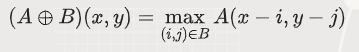
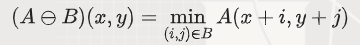

滑动结构元素，每一次查找最大值（对于膨胀）或最小值（对于腐蚀）来更新目标图像中的像素点。

#### 数学逻辑

- 膨胀操作（Dilation）：<br>



- 腐蚀操作（Erosion）：<br>



其中：<br>
A  是输入图像。<br>
B  是结构元素（Structuring Element）。<br>
(x, y) 是图像中的像素坐标。<br>
(i, j) 是结构元素中的坐标偏移。<br>

#### 结构元素
通常是一个小矩阵，其值可以是0或1。<br>
结构元素的大小和形状可以根据具体应用进行设计，<br>
常见的结构元素形状包括矩形、圆形和十字形等。<br>
例如，一个3x3的矩形结构元素可以表示为：<br>
[1, 1, 1]<br>
[1, 1, 1]<br>
[1, 1, 1]<br>

滑动结构元素的过程类似于卷积操作。具体来说，滑动结构元素在图像上的作用如下：<br>

- 膨胀操作（Dilation）：<br>
将结构元素的中心对准图像中的每一个像素点。<br>
在结构元素覆盖区域内查找最大值。<br>
将最大值赋给目标图像的对应像素。<br>

- 腐蚀操作（Erosion）：<br>
将结构元素的中心对准图像中的每一个像素点。<br>
在结构元素覆盖区域内查找最小值。<br>
将最小值赋给目标图像的对应像素。<br>


#### 代码实现

以下是使用滑动结构元素查找最大最小值的方法实现膨胀和腐蚀操作的C++代码。

```cpp
#include <iostream>
#include <vector>
#include <opencv2/opencv.hpp>

// 膨胀操作
cv::Mat dilate(const cv::Mat& src, const std::vector<std::vector<int>>& structElem) 
{
    int elemHeight = structElem.size();
    int elemWidth = structElem[0].size();
    int offsetX = elemWidth / 2;
    int offsetY = elemHeight / 2;

    cv::Mat dst = src.clone();

    for (int y = 0; y < src.rows; ++y) 
    {
        for (int x = 0; x < src.cols; ++x) 
        {
            int maxVal = 0;
            for (int j = 0; j < elemHeight; ++j) 
            {
                for (int i = 0; i < elemWidth; ++i) 
                {
                    int srcX = x + i - offsetX;
                    int srcY = y + j - offsetY;
                    if (srcX >= 0 && srcX < src.cols && srcY >= 0 && srcY < src.rows) 
                    {
                        if (structElem[j][i] == 1) 
                        {
                            maxVal = std::max(maxVal, src.at<uchar>(srcY, srcX));
                        }
                    }
                }
            }
            dst.at<uchar>(y, x) = maxVal;
        }
    }

    return dst;
}

// 腐蚀操作
cv::Mat erode(const cv::Mat& src, const std::vector<std::vector<int>>& structElem) 
{
    int elemHeight = structElem.size();
    int elemWidth = structElem[0].size();
    int offsetX = elemWidth / 2;
    int offsetY = elemHeight / 2;

    cv::Mat dst = src.clone();

    for (int y = 0; y < src.rows; ++y) 
    {
        for (int x = 0; x < src.cols; ++x) 
        {
            int minVal = 255;
            for (int j = 0; j < elemHeight; ++j) 
            {
                for (int i = 0; i < elemWidth; ++i) 
                {
                    int srcX = x + i - offsetX;
                    int srcY = y + j - offsetY;
                    if (srcX >= 0 && srcX < src.cols && srcY >= 0 && srcY < src.rows) 
                    {
                        if (structElem[j][i] == 1) 
                        {
                            minVal = std::min(minVal, src.at<uchar>(srcY, srcX));
                        }
                    }
                }
            }
            dst.at<uchar>(y, x) = minVal;
        }
    }

    return dst;
}

int main() {
    // 从文件加载灰度图像
    cv::Mat img = cv::imread("input.jpg", cv::IMREAD_GRAYSCALE);
    if (img.empty()) 
    {
        std::cerr << "Error: Could not open or find the image." << std::endl;
        return -1;
    }

    // 定义一个3x3的结构元素
    std::vector<std::vector<int>> structElem = 
    {
        {1, 1, 1},
        {1, 1, 1},
        {1, 1, 1}
    };

    // 进行膨胀操作
    cv::Mat dilatedImg = dilate(img, structElem);
    cv::imwrite("dilated.jpg", dilatedImg);

    // 进行腐蚀操作
    cv::Mat erodedImg = erode(img, structElem);
    cv::imwrite("eroded.jpg", erodedImg);

    // 显示图像
    cv::imshow("Original Image", img);
    cv::imshow("Dilated Image", dilatedImg);
    cv::imshow("Eroded Image", erodedImg);
    cv::waitKey(0);

    return 0;
}
```

#### 代码解释

1. *dilate 函数*：实现图像的膨胀操作。
   - 遍历源图像的每个像素点。
   - 对于每个像素点，遍历结构元素的每个元素。
   - 在结构元素覆盖区域内查找最大值，并将其赋值给目标图像的对应像素。

2. *erode 函数*：实现图像的腐蚀操作。
   - 遍历源图像的每个像素点。
   - 对于每个像素点，遍历结构元素的每个元素。
   - 在结构元素覆盖区域内查找最小值，并将其赋值给目标图像的对应像素。

