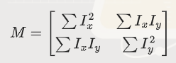
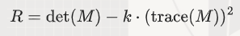

一种用来找到图像中“角点”的方法。角点是图像中那些在两个方向上都有显著变化的点，比如图像中的拐角、交叉点等。<br>
我们可以把角点想象成图像中的“特征点”，这些点在图像匹配和物体识别中非常有用。<br>
它基于图像灰度变化的自相关矩阵（也称为结构张量）来检测角点。<br>

#### 数学步骤

1. *计算图像梯度*：
- 对图像进行水平和垂直方向的梯度计算，得到梯度图像 I_x 和 I_y。<br>

图像的每个像素在水平和垂直两个方向上的变化。<br>
这就像是我们在看一张图时，想知道每个点的“坡度”有多大。<br>
我们用数学方法计算出每个点在这两个方向上的变化，这些变化值叫做“梯度”。<br>

2. *计算自相关矩阵*：<br>
对每个像素点，计算自相关矩阵 M：<br>



这里的求和是对一个窗口内的像素进行的。<br>
对每个像素点，看看它周围的小区域内的变化情况。<br>
我们用一个小方块（称为“窗口”）覆盖住这个像素点，然后计算这个小方块内的变化情况。<br>
我们关心的是这个小方块内的变化有多大，这可以帮助我们判断这个点是不是一个角点<br>

3. *计算响应函数*：<br>
判断一个点是不是角点，用一个公式计算一个“响应值”。<br>
这个响应值越大，就说明这个点更有可能是一个角点。这个公式考虑了局部变化的大小和方向。<br>

对自相关矩阵 M，计算响应函数 R：<br>



其中，det(M) = lambda_1 * lambda_2 是矩阵的行列式，<br>
trace(M) = lambda_1 + lambda_2 是矩阵的迹，<br>
lambda_1 和 lambda_2 是矩阵的特征值。<br>
k 是一个经验常数，通常取值在0.04到0.06之间。<br>

4. *非极大值抑制*：<br>

对响应函数 R进行非极大值抑制，保留局部最大值作为角点。<br>
遍历整个图像，找出那些响应值最大的点，并且这些点周围没有比它更大的点。<br>
这些点就是我们要找的角点<br>

#### 代码实现

```cpp
#include <iostream>
#include <opencv2/opencv.hpp>
#include <vector>
#include <cmath>

// 计算图像梯度
void computeGradient(const cv::Mat& src, cv::Mat& gradX, cv::Mat& gradY) {
    gradX = cv::Mat::zeros(src.size(), CV_32F);
    gradY = cv::Mat::zeros(src.size(), CV_32F);

    for (int y = 1; y < src.rows - 1; ++y) {
        for (int x = 1; x < src.cols - 1; ++x) {
            gradX.at<float>(y, x) = (src.at<uchar>(y, x + 1) - src.at<uchar>(y, x - 1)) / 2.0f;
            gradY.at<float>(y, x) = (src.at<uchar>(y + 1, x) - src.at<uchar>(y - 1, x)) / 2.0f;
        }
    }
}

// 计算Harris响应
cv::Mat computeHarrisResponse(const cv::Mat& gradX, const cv::Mat& gradY, float k, int windowSize) {
    cv::Mat response = cv::Mat::zeros(gradX.size(), CV_32F);

    int offset = windowSize / 2;

    for (int y = offset; y < gradX.rows - offset; ++y) {
        for (int x = offset; x < gradX.cols - offset; ++x) {
            float sumIx2 = 0.0f;
            float sumIy2 = 0.0f;
            float sumIxIy = 0.0f;

            for (int wy = -offset; wy <= offset; ++wy) {
                for (int wx = -offset; wx <= offset; ++wx) {
                    float ix = gradX.at<float>(y + wy, x + wx);
                    float iy = gradY.at<float>(y + wy, x + wx);

                    sumIx2 += ix * ix;
                    sumIy2 += iy * iy;
                    sumIxIy += ix * iy;
                }
            }

            float detM = sumIx2 * sumIy2 - sumIxIy * sumIxIy;
            float traceM = sumIx2 + sumIy2;
            response.at<float>(y, x) = detM - k * traceM * traceM;
        }
    }

    return response;
}

// 非极大值抑制
std::vector<cv::Point> nonMaxSuppression(const cv::Mat& response, float threshold) {
    std::vector<cv::Point> corners;

    for (int y = 1; y < response.rows - 1; ++y) {
        for (int x = 1; x < response.cols - 1; ++x) {
            float value = response.at<float>(y, x);
            if (value > threshold &&
                value > response.at<float>(y - 1, x - 1) &&
                value > response.at<float>(y - 1, x) &&
                value > response.at<float>(y - 1, x + 1) &&
                value > response.at<float>(y, x - 1) &&
                value > response.at<float>(y, x + 1) &&
                value > response.at<float>(y + 1, x - 1) &&
                value > response.at<float>(y + 1, x) &&
                value > response.at<float>(y + 1, x + 1)) {
                corners.push_back(cv::Point(x, y));
            }
        }
    }

    return corners;
}

int main() {
    // 从文件加载灰度图像
    cv::Mat img = cv::imread("input.jpg", cv::IMREAD_GRAYSCALE);
    if (img.empty()) {
        std::cerr << "Error: Could not open or find the image." << std::endl;
        return -1;
    }

    // 计算图像梯度
    cv::Mat gradX, gradY;
    computeGradient(img, gradX, gradY);

    // 计算Harris响应
    float k = 0.04;
    int windowSize = 3;
    cv::Mat response = computeHarrisResponse(gradX, gradY, k, windowSize);

    // 非极大值抑制
    float threshold = 1e6;
    std::vector<cv::Point> corners = nonMaxSuppression(response, threshold);

    // 在图像上绘制角点
    cv::Mat result;
    cv::cvtColor(img, result, cv::COLOR_GRAY2BGR);
    for (const auto& corner : corners) {
        cv::circle(result, corner, 5, cv::Scalar(0, 0, 255), 2);
    }

    // 保存和显示结果图像
    cv::imwrite("harris_corners.jpg", result);
    cv::imshow("Harris Corners", result);
    cv::waitKey(0);

    return 0;
}
```

#### 代码解释

1. *computeGradient 函数*：计算图像的水平和垂直梯度。
   - 使用简单的差分算子计算梯度。

2. *computeHarrisResponse 函数*：计算Harris响应。
   - 遍历图像的每个像素点。
   - 在每个像素点周围的窗口内计算自相关矩阵的元素。
   - 根据自相关矩阵计算响应函数 R。

3. *nonMaxSuppression 函数*：进行非极大值抑制。
   - 遍历响应图像的每个像素点。
   - 保留局部最大值作为角点。


