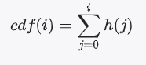
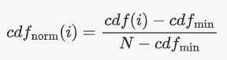
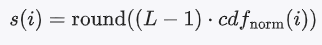

直方图均衡化（Histogram Equalization）是一种用于增强图像对比度的技术，通过调整图像灰度级的分布，使得图像的灰度直方图更加均匀。可以把它想象成调整一张照片的亮度和对比度，让照片中的暗部变得更亮，亮部变得更暗，从而使得整个图像的细节更加清晰。

#### 实现步骤

1. *计算直方图*
计算图像中每个灰度级出现的频率，得到图像的灰度直方图<br>
设图像的灰度级范围为[0, L-1]，其中L是灰度级的总数。灰度级为i的像素数为h(i)，总像素数为N。

   h(i) = number of pixels with gray level  i

2. *计算累积分布函数（CDF）*：计算灰度级的累积分布函数，将每个灰度级的频率累加起来

  


3. *归一化累积分布函数*：将累积分布函数归一化，使其范围在[0, 1]之间

    

   其中，cdf{min}是累积分布函数的最小非零值。

4. *映射新的灰度级*：根据归一化的累积分布函数，将原始图像的灰度级映射到新的灰度级

    

   其中，{round}表示四舍五入操作。

通过以上步骤，直方图均衡化将原始图像的灰度级重新分布，使得图像的对比度得到增强，更多的细节得以显现。

#### 示例代码


```cpp
#include <opencv2/opencv.hpp>
#include <iostream>

using namespace cv;
using namespace std;

// 直方图均衡化函数
void histogramEqualization(Mat& src, Mat& dst) {
    // 第一步：计算直方图
    // 初始化直方图数组，大小为256，对应灰度级0-255
    int hist[256] = {0};
    for (int y = 0; y < src.rows; y++) {
        for (int x = 0; x < src.cols; x++) {
            // 统计每个灰度级的像素数量
            hist[src.at<uchar>(y, x)]++;
        }
    }

    // 第二步：计算累积分布函数（CDF）
    // 初始化CDF数组
    int cdf[256] = {0};
    cdf[0] = hist[0];
    for (int i = 1; i < 256; i++) {
        // 计算每个灰度级的CDF
        cdf[i] = cdf[i - 1] + hist[i];
    }

    // 第三步：归一化累积分布函数
    // 找到CDF中的最小非零值
    int cdf_min = 0;
    for (int i = 0; i < 256; i++) {
        if (cdf[i] != 0) {
            cdf_min = cdf[i];
            break;
        }
    }

    // 计算总像素数
    int total_pixels = src.rows * src.cols;
    // 初始化归一化CDF数组
    int cdf_normalized[256] = {0};
    for (int i = 0; i < 256; i++) {
        // 将CDF归一化到[0, 255]范围
        cdf_normalized[i] = round((float)(cdf[i] - cdf_min) / (total_pixels - cdf_min) * 255);
    }

    // 第四步：映射新的灰度级
    // 克隆源图像到目标图像
    dst = src.clone();
    for (int y = 0; y < src.rows; y++) {
        for (int x = 0; x < src.cols; x++) {
            // 根据归一化的CDF，将原始灰度级映射到新的灰度级
            dst.at<uchar>(y, x) = cdf_normalized[src.at<uchar>(y, x)];
        }
    }
}

int main(int argc, char** argv) {
    // 加载图像
    Mat src = imread("input.jpg", IMREAD_GRAYSCALE);
    if (src.empty()) {
        cout << "无法打开或找到图像！" << endl;
        return -1;
    }

    // 创建目标Mat对象
    Mat dst;

    // 应用直方图均衡化
    histogramEqualization(src, dst);

    // 显示结果
    imshow("原始图像", src);
    imshow("均衡化后的图像", dst);
    waitKey(0);

    // 保存结果
    imwrite("output.jpg", dst);

    return 0;
}
```

#### 代码解释

1. *计算直方图*：
   - 遍历图像的每个像素点，统计每个灰度级的像素数量，存储在`hist`数组中。

2. *计算累积分布函数（CDF）*：
   - 计算每个灰度级的累积分布函数，存储在`cdf`数组中。

3. *归一化累积分布函数*：
   - 找到累积分布函数的最小非零值`cdf_min`，并将CDF归一化，存储在`cdf_normalized`数组中。

4. *映射新的灰度级*：
   - 遍历图像的每个像素点，根据归一化的CDF，将原始灰度级映射到新的灰度级。

5. *显示和保存结果*：
   - 使用OpenCV函数`imshow`显示原始图像和均衡化后的图像，并使用`imwrite`保存结果。


