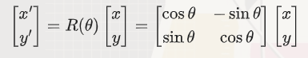

#### 数学逻辑

图像的旋转操作需要将每个像素点的位置通过一个旋转变换公式计算出新的位置。旋转变换公式基于二维平面上的旋转矩阵。

*旋转矩阵*：

[cosθ,-sinθ]
[sinθ, cosθ]

其中，θ 是旋转角度，逆时针方向为正。

*旋转公式*：



其中，(x, y)是原始图像中的坐标，(x', y')是旋转后的坐标。

#### 代码实现

使用最近邻插值算法来计算旋转后的像素值。

```cpp
#include <iostream>
#include <opencv2/opencv.hpp>
#include <cmath>

// 计算旋转后的坐标
std::pair<int, int> rotatePoint(int x, int y, int centerX, int centerY, double angle) {
    double radians = angle * M_PI / 180.0;
    double cosTheta = cos(radians);
    double sinTheta = sin(radians);

    int newX = static_cast<int>(cosTheta * (x - centerX) - sinTheta * (y - centerY) + centerX);
    int newY = static_cast<int>(sinTheta * (x - centerX) + cosTheta * (y - centerY) + centerY);

    return {newX, newY};
}

// 最近邻插值算法实现图像旋转
cv::Mat rotateImage(const cv::Mat& src, double angle) {
    int width = src.cols;
    int height = src.rows;
    cv::Mat dst(height, width, src.type(), cv::Scalar(255, 255, 255));

    int centerX = width / 2;
    int centerY = height / 2;

    for (int y = 0; y < height; ++y) {
        for (int x = 0; x < width; ++x) {
            // 计算旋转后的坐标
            auto [srcX, srcY] = rotatePoint(x, y, centerX, centerY, -angle);

            // 检查坐标是否在源图像范围内
            if (srcX >= 0 && srcX < width && srcY >= 0 && srcY < height) {
                dst.at<cv::Vec3b>(y, x) = src.at<cv::Vec3b>(srcY, srcX);
            }
        }
    }

    return dst;
}

int main() {
    // 从文件加载图像
    cv::Mat img = cv::imread("input.jpg");
    if (img.empty()) {
        std::cerr << "Error: Could not open or find the image." << std::endl;
        return -1;
    }

    // 旋转图像
    double angle = 45.0; // 旋转角度
    cv::Mat rotatedImg = rotateImage(img, angle);
    cv::imwrite("rotated.jpg", rotatedImg);

    // 显示图像
    cv::imshow("Original Image", img);
    cv::imshow("Rotated Image", rotatedImg);
    cv::waitKey(0);

    return 0;
}
```

#### 代码解释

1. *rotatePoint 函数*：计算旋转后的坐标。
   - 将角度转换为弧度。
   - 使用旋转矩阵计算旋转后的坐标。

2. *rotateImage 函数*：使用最近邻插值算法实现图像旋转。
   - 遍历目标图像的每个像素点。
   - 计算旋转后的坐标。
   - 检查旋转后的坐标是否在源图像范围内。
   - 使用最近邻插值算法获取源图像的像素值，并赋值给目标图像。
