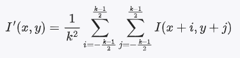
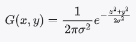

#### 均值滤波（Mean Filtering）

均值滤波是一种线性平滑滤波方法，通过将每个像素的值替换为其邻域内像素值的平均值来减少噪声。假设有一个  k * k  的滤波窗口，均值滤波公式如下：




其中：
-  I(x, y)  是原图像在 (x, y) 位置的像素值
-  I'(x, y) 是滤波后的图像在 (x, y) 位置的像素值
-  k 是滤波窗口的尺寸（通常取奇数）
-  公式中累加符号的上下限（k-1）/2 和 -(k-1)/2

假设我们有一个 3x3 的滤波窗口，当前像素位于 (x, y)。滤波窗口覆盖的像素范围如下所示：

```
+-----+-----+-----+
| (x-1, y-1) | (x, y-1) | (x+1, y-1) |
+-----+-----+-----+
| (x-1, y)   | (x, y)   | (x+1, y)   |
+-----+-----+-----+
| (x-1, y+1) | (x, y+1) | (x+1, y+1) |
+-----+-----+-----+
```

在这种情况下，累加的范围是：

-  i  从 -1 到 1：
  - i = -1  表示 (x-1, y)
  - i = 0   表示 (x, y)
  - i = 1   表示 (x+1, y)

-  j  从 -1 到 1：
  -  j = -1  表示 (x, y-1)
  -  j = 0  表示 (x, y)
  -  j = 1  表示 (x, y+1)


 **代码实现**：

```cpp
#include <opencv2/opencv.hpp>
#include <iostream>

cv::Mat meanFilter(const cv::Mat& src, int kernelSize) {
    cv::Mat dst = src.clone();
    int radius = kernelSize / 2;

    for (int y = radius; y < src.rows - radius; ++y) {
        for (int x = radius; x < src.cols - radius; ++x) {
            float sum = 0.0;
            for (int dy = -radius; dy <= radius; ++dy) {
                for (int dx = -radius; dx <= radius; ++dx) {
                    sum += src.at<uchar>(y + dy, x + dx);
                }
            }
            dst.at<uchar>(y, x) = cv::saturate_cast<uchar>(sum / (kernelSize * kernelSize));
        }
    }

    return dst;
}

int main() {
    cv::Mat src = cv::imread("path_to_your_image.jpg", cv::IMREAD_GRAYSCALE);
    if (src.empty()) {
        std::cerr << "Could not open or find the image!" << std::endl;
        return -1;
    }

    int kernelSize = 3; // 滤波窗口大小
    cv::Mat dst = meanFilter(src, kernelSize);

    cv::imshow("Original Image", src);
    cv::imshow("Mean Filtered Image", dst);
    cv::waitKey(0);

    return 0;
}
```

**解释**

    - **滤波窗口的尺寸 `kernelSize`**：在上述代码中，我们使用尺寸为 3 的滤波窗口
    - **遍历图像的每个像素**：对于每个像素 (x, y)，我们遍历其周围的像素范围
    - **累加范围**：使用两个嵌套的循环 `for (int dy = -radius; dy <= radius; ++dy)` 和 `for (int dx = -radius; dx <= radius; ++dx)` 来累加当前像素及其周围像素的值
    - **计算均值**：累加完所有像素值后，计算均值并将结果赋值给目标图像


#### 高斯滤波（Gaussian Filtering）

高斯滤波是一种线性平滑滤波方法，通过将图像与高斯核进行卷积来减少噪声。高斯核的权重是根据高斯函数计算的，公式如下：



其中：
-  G(x, y)  是高斯核在 (x, y) 位置的值
-  sigma  是标准差，决定了高斯核的宽度

### C++ 实现

```cpp
#include <opencv2/opencv.hpp>
#include <iostream>
#include <vector>

cv::Mat gaussianFilter(const cv::Mat& src, int kernelSize, double sigma) {
    cv::Mat dst = src.clone();
    int radius = kernelSize / 2;

    // 生成高斯核
    std::vector<std::vector<double>> kernel(kernelSize, std::vector<double>(kernelSize));
    double sum = 0.0;
    for (int y = -radius; y <= radius; ++y) {
        for (int x = -radius; x <= radius; ++x) {
            kernel[y + radius][x + radius] = std::exp(-(x * x + y * y) / (2 * sigma * sigma));
            sum += kernel[y + radius][x + radius];
        }
    }
    // 归一化高斯核
    for (int y = 0; y < kernelSize; ++y) {
        for (int x = 0; x < kernelSize; ++x) {
            kernel[y][x] /= sum;
        }
    }

    for (int y = radius; y < src.rows - radius; ++y) {
        for (int x = radius; x < src.cols - radius; ++x) {
            double value = 0.0;
            for (int dy = -radius; dy <= radius; ++dy) {
                for (int dx = -radius; dx <= radius; ++dx) {
                    value += kernel[dy + radius][dx + radius] * src.at<uchar>(y + dy, x + dx);
                }
            }
            dst.at<uchar>(y, x) = cv::saturate_cast<uchar>(value);
        }
    }

    return dst;
}

int main() {
    cv::Mat src = cv::imread("path_to_your_image.jpg", cv::IMREAD_GRAYSCALE);
    if (src.empty()) {
        std::cerr << "Could not open or find the image!" << std::endl;
        return -1;
    }

    int kernelSize = 5; // 滤波窗口大小
    double sigma = 1.0; // 标准差
    cv::Mat dst = gaussianFilter(src, kernelSize, sigma);

    cv::imshow("Original Image", src);
    cv::imshow("Gaussian Filtered Image", dst);
    cv::waitKey(0);

    return 0;
}
```

## 3. 中值滤波（Median Filtering）

### 数学原理

中值滤波是一种非线性滤波方法，通过将每个像素的值替换为其邻域内像素值的中值来减少噪声。中值滤波特别适用于去除椒盐噪声。

### C++ 实现

```cpp
#include <opencv2/opencv.hpp>
#include <iostream>
#include <vector>
#include <algorithm>

cv::Mat medianFilter(const cv::Mat& src, int kernelSize) {
    cv::Mat dst = src.clone();
    int radius = kernelSize / 2;

    for (int y = radius; y < src.rows - radius; ++y) {
        for (int x = radius; x < src.cols - radius; ++x) {
            std::vector<uchar> neighborhood;
            for (int dy = -radius; dy <= radius; ++dy) {
                for (int dx = -radius; dx <= radius; ++dx) {
                    neighborhood.push_back(src.at<uchar>(y + dy, x + dx));
                }
            }
            std::nth_element(neighborhood.begin(), neighborhood.begin() + neighborhood.size() / 2, neighborhood.end());
            dst.at<uchar>(y, x) = neighborhood[neighborhood.size() / 2];
        }
    }

    return dst;
}

int main() {
    cv::Mat src = cv::imread("path_to_your_image.jpg", cv::IMREAD_GRAYSCALE);
    if (src.empty()) {
        std::cerr << "Could not open or find the image!" << std::endl;
        return -1;
    }

    int kernelSize = 3; // 滤波窗口大小
    cv::Mat dst = medianFilter(src, kernelSize);

    cv::imshow("Original Image", src);
    cv::imshow("Median Filtered Image", dst);
    cv::waitKey(0);

    return 0;
}
```

### 解释

1. **均值滤波**通过计算像素邻域的平均值来平滑图像，减少噪声。
2. **高斯滤波**使用高斯卷积核对图像进行平滑，考虑了距离越近的像素权重越大的原则，效果更自然。
3. **中值滤波**通过取邻域内像素值的中值来消除噪声，特别适用于椒盐噪声。

这些代码示例展示了如何遍历图像的每个像素，并应用不同的滤波算法来去除噪声。希望这些解释和示例代码能帮助你更好地理解和实现图像去噪。如果有任何问题或需要进一步的解释，请随时提问！