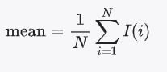
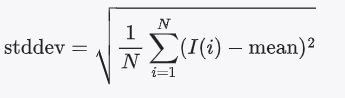
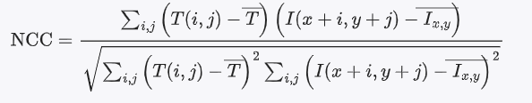

 **1.概念**：在一张大图（待匹配图像）中找到一小块图（模板图像）的位置

 **2.主要步骤**：

    1. **读取图像和模板**。
    2. **计算模板图像的平均值和标准差**。
    3. **遍历待匹配图像的每个像素点**。
    4. **在每个位置计算模板和图像窗口的归一化相关系数**。
    5. **找到最大相关系数的位置**。

 **计算均值**：均值是图像块中所有像素的平均值

 

 其中N是图像块中的像素总数，等于图像的宽高之积，I(i)是图像块中第i个像素的值

 **作用**是通过减去均值，消除图像块中的亮度差异，使亮度标准化

 **计算标准差**：衡量像素值分布的离散程度：

   

  其中，mean是图像块的均值。

  **作用**是消除对比度差异，通过初一标准差，图像块的对比度差异被标准化

**什么是亮度和对比度？**

  1.亮度：与像素值直接关联，灰度图的亮度就是像素值（0 ~ 255 ），彩色图的亮度是三个通道的像素值的加权平均值
  2.对比度：指的是图像中最亮像素 和最暗像素之间的差值，如果是彩色图像，可以转换为灰度图像再计算最大值和最小值的差值。

**彩色图像是如何转为灰度图像的？**
 
通常采用对三个通道的像素值取加权平均的方式，考虑人眼对不同颜色的敏感度，给不同的颜色通道赋予不同的权重。通常，绿色占主导地位，其次是红色，蓝色对亮度的影响最小

**计算归一化相关系数**：表示模板图像和当前窗口的相似度，值越大，相似度越高

公式：



分子部分为sum += (templ_val - mean_templ) * (img_val - mean_img); 模板图像像素亮度标准化的值，乘以大图像亮度标准化的值，全部累加

分母部分可以分解为 N*模板图像的标准差*大图像的标准差，N = templ.rows * templ.cols 

### 代码实现

```cpp
#include <opencv2/opencv.hpp>
#include <iostream>
#include <cmath>

using namespace cv;
using namespace std;

// 计算图像块的均值
double mean(const Mat& img) {
    double sum = 0.0;
    for (int i = 0; i < img.rows; ++i) {
        for (int j = 0; j < img.cols; ++j) {
            sum += img.at<uchar>(i, j);
        }
    }
    return sum / (img.rows * img.cols);
}

// 计算图像块的标准差
double stddev(const Mat& img, double mean_val) {
    double sum = 0.0;
    for (int i = 0; i < img.rows; ++i) {
        for (int j = 0; j < img.cols; ++j) {
            sum += pow(img.at<uchar>(i, j) - mean_val, 2);
        }
    }
    return sqrt(sum / (img.rows * img.cols));
}

// 计算归一化相关系数
double normalized_cross_correlation(const Mat& img, const Mat& templ, int x, int y) {
    double mean_templ = mean(templ);
    double stddev_templ = stddev(templ, mean_templ);

    double sum = 0.0;
    double mean_img = mean(img(Rect(x, y, templ.cols, templ.rows)));
    double stddev_img = stddev(img(Rect(x, y, templ.cols, templ.rows)), mean_img);

    for (int i = 0; i < templ.rows; ++i) {
        for (int j = 0; j < templ.cols; ++j) {
            double templ_val = templ.at<uchar>(i, j);
            double img_val = img.at<uchar>(y + i, x + j);
            sum += (templ_val - mean_templ) * (img_val - mean_img);
        }
    }

    return sum / (templ.rows * templ.cols * stddev_templ * stddev_img);
}

int main() {
    // 读取待匹配图像和模板图像
    Mat img = imread("source_image.jpg", IMREAD_GRAYSCALE);
    Mat templ = imread("template_image.jpg", IMREAD_GRAYSCALE);

    if (img.empty() || templ.empty()) {
        cout << "无法打开或找到图像!" << endl;
        return -1;
    }

    // 初始化最大相关系数和匹配位置
    double max_ncc = -1.0;
    Point matchLoc;

    // 遍历待匹配图像的每个像素点
    for (int y = 0; y <= img.rows - templ.rows; ++y) {
        for (int x = 0; x <= img.cols - templ.cols; ++x) {
            double ncc = normalized_cross_correlation(img, templ, x, y);
            if (ncc > max_ncc) {
                max_ncc = ncc;
                matchLoc = Point(x, y);
            }
        }
    }

    // 在图像中绘制矩形，标记匹配位置
    rectangle(img, matchLoc, Point(matchLoc.x + templ.cols, matchLoc.y + templ.rows), Scalar::all(0), 2, 8, 0);

    // 显示结果
    namedWindow("Image", WINDOW_AUTOSIZE);
    imshow("Image", img);
    
    waitKey(0);
    return 0;
}
```

**代码解释**

    1. **计算均值和标准差**：
    - `mean` 函数计算图像块的平均值。
    - `stddev` 函数计算图像块的标准差。

    2. **计算归一化相关系数**：
    - `normalized_cross_correlation` 函数计算给定位置的模板和图像窗口的NCC。

    3. **遍历图像**：
    - 在主函数中，逐个遍历待匹配图像的每个像素点，计算模板和当前窗口的NCC。
    - 找到NCC最大的点作为匹配位置。

    4. **绘制匹配结果**：
    - 使用 `rectangle` 函数在图像上绘制矩形，标记出匹配位置。
    - 显示最终结果。

