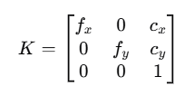
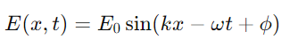
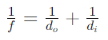
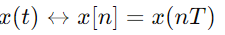
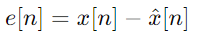
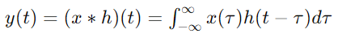
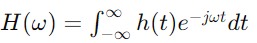
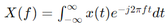
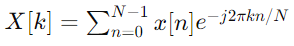

手机摄像头涉及的光源和镜头的知识是一个跨学科的内容，其中包含了物理学、信号处理、图像处理等方面的知识
### 1. 相关的知识点

1. *光源和照明*：<br>
   - 光的性质（波粒二象性）<br>
   - 光源的类型和特点（自然光、人工光源）<br>
   - 照明条件对图像质量的影响

2. *镜头和成像*：<br>
   - 镜头的基本结构与光学特性（焦距、光圈、畸变）<br>
   - 成像过程（光学成像原理）

3. *信号处理*：<br>
   - 信号与噪声<br>
   - 采样和量化<br>
   - 低通滤波器和高通滤波器

4. *线性时不变系统（LTI系统）*：<br>
   - 系统的线性性和时不变性<br>
   - 卷积和系统响应<br>
   - 系统的频率响应

5. *傅里叶变换*：
   - 时域与频域<br>
   - 傅里叶变换的基本性质<br>
   - 离散傅里叶变换（DFT）和快速傅里叶变换（FFT）


##### 镜头的基本结构以及光学特性

-焦距 (fx, fy): 分别为5268.66和5281.08。<br>
-光心 (cx, cy): 分别为441.36和501.16。<br>
- 内参矩阵:<br>

  ```
  [ 5268.66,  0,    441.36 ]
  [ 0,    5281.08,  501.16 ]
  [ 0,       0,        1   ]
  ```
相机的内参矩阵通常包含了焦距（fx, fy）、光心（cx, cy）以及一个缩放因子。<br>
这些参数通常用来描述相机的成像几何特性，它们决定了3D世界坐标到2D图像坐标的映射关系。

这些数值通常表示为像素（pixels）单位，而不是毫米（mm）或其他物理尺寸单位。<br>
焦距和光心的数值反映了相机成像平面（通常是图像传感器）上的像素坐标，而不是实际的物理尺寸。

内参矩阵的格式通常如下：




### 2. 每个知识点的数学逻辑

1. *光源和照明*：<br>
   - 光波的波动方程：

  

   - 光源的色温和光谱分布

2. *镜头和成像*：<br>
   - 薄透镜公式：<br>
   
    

   - 像差（畸变）的数学描述

3. *信号处理*：<br>
   - 采样定理：<br>
   
    

   - 量化误差公式：<br>
   
    


4. *线性时不变系统（LTI系统）*：<br>
   - 卷积积分：<br>
   
    

   - 频率响应函数：<br>
   
   

5. *傅里叶变换*：<br>
   - 连续傅里叶变换（CFT）：<br>
   
   

   - 离散傅里叶变换（DFT）：<br>
   
   

### 3. 用大白话解释这些知识点

1. *光源和照明*：<br>
   - 光是一种波，就像海浪一样，有波峰和波谷。不同的光源（比如太阳光、LED灯）发出的光有不同的颜色和亮度，对拍照效果有很大影响。

2. *镜头和成像*：<br>
   - 镜头就像一个放大镜，可以把光聚集到一个点上形成图像。焦距决定了你能拍多远的东西，光圈大小决定了照片的亮度和背景的虚化程度。镜头可能会有一些变形，像是把直的东西拍成弯的，这就是畸变。

3. *信号处理*：<br>
   - 拍照时，相机把光信号转换成电子信号。这些信号有时会有一些杂音（噪声），需要通过一些技术把它们过滤掉。采样就是把连续的光信号变成一个个点，量化是把这些点的亮度变成数字。

4. *线性时不变系统（LTI系统）*：<br>
   - 系统如果是线性的，输入和输出的关系很简单，比如输入增加一倍，输出也增加一倍；如果是时不变的，不管什么时候输入同样的信号，输出都是一样的。<br>
   卷积是用来计算输入信号经过系统后的输出信号的方法，就像是把输入信号和系统的反应模式叠加在一起。频率响应告诉你系统对不同频率的信号有多敏感。

5. *傅里叶变换*：<br>
   - 傅里叶变换是一个把信号从时域变到频域的工具。时域是看信号随时间的变化，频域是看信号包含了哪些频率成分。DFT和FFT是傅里叶变换在计算机中的实现方法，用来分析数字信号的频率成分。
