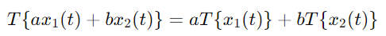
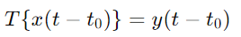
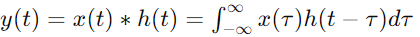
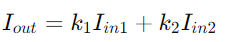

#### 线性时不变系统（LTI系统）

线性时不变系统（Linear Time-Invariant System, LTI系统）在信号处理和系统理论中是一个重要的概念。
LTI系统有两个主要特性：线性性（Linearity）和时不变性（Time Invariance）。

- *线性性*：对于一个系统，如果对输入信号的线性组合的响应等于对每个输入信号单独响应的线性组合，则该系统是线性的。用数学表达式表示为：

 

  其中 T 表示系统操作，x_1(t) 和 x_2(t) 是输入信号，a 和 b 是常数。

- *时不变性*：如果系统对某个输入信号的响应在时间上是恒定的，不随时间改变，则该系统是时不变的。用数学表达式表示为：

 

  其中 t_0 是时间移位。

对LTI系统，输入与输出之间的关系可以用卷积积分表示：

其中 h(t) 是系统的冲激响应（Impulse Response）

#### 相机光学系统

相机光学系统由镜头、光源和传感器组成，可以简化为一个对光信号进行处理的系统。相机中的光学系统也有两个重要特性：

- *线性性*：在理想情况下，相机的响应是线性的，即入射光强度的线性组合将导致图像传感器上相应的线性组合响应。这可以用如下表达式表示：
 
  其中 I_{in1} 和 I_{in2} 是不同光源的输入强度，k_1 和 k_2 是比例常数。

- *时不变性*：对于相机，时不变性意味着在相同条件下，不同时间拍摄同一场景的结果应该是相同的。相机的系统响应不随时间变化。

#### 两者之间的联系

从数学角度看，理想相机光学系统可以视为一个LTI系统，因为它符合线性性和时不变性。相机对入射光信号的响应可以用卷积表示，镜头的光学传递函数相当于LTI系统的冲激响应。

#### 2. 用外行人能听明白的语言描述这两个概念以及它们之间的联系

#### 线性时不变系统

线性时不变系统（LTI系统）是一个在输入和输出之间有规则关系的系统。这种系统有两个主要特点：

- *线性*：如果你给系统两个输入信号，系统的反应会是这两个输入信号的反应的总和。
例如，如果你给系统输入一个信号，得到一个输出，再给系统输入另一个信号，得到另一个输出，
那么同时给系统输入这两个信号的总和，系统的输出也会是前两个输出的总和。
  
- *时不变*：系统的行为不随时间变化。如果你今天给系统一个输入，得到一个输出；明天再给它相同的输入，你会得到相同的输出。

#### 相机光学系统

相机的光学系统由镜头、光源和传感器组成。这个系统的主要任务是捕捉光线并生成图像。理想情况下，相机有两个类似于LTI系统的特点：

- *线性*：相机对光线的反应是线性的。这意味着如果你对相机输入两束不同的光线，传感器记录的结果会是这两束光线的结果的总和。
例如，如果一束光让相机记录某个亮度，另一束光让相机记录另一个亮度，那么同时输入这两束光时，记录的亮度就是前两者的总和。

- *时不变*：相机的性能不会随时间改变。这意味着如果你今天和明天在相同条件下拍摄同一场景，应该得到相同的照片。

#### 两者之间的联系

相机光学系统可以看作一个LTI系统，因为它的线性和时不变特性。这意味着你可以用类似的方法来理解和处理相机和LTI系统。
比如，你可以用数学方法来预测相机在不同光线条件下的表现，或者用类似的算法来处理和改进相机捕捉到的图像。