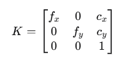
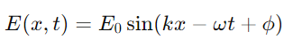
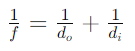
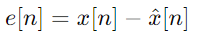
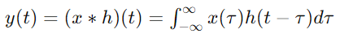
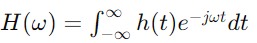
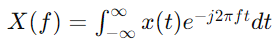
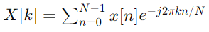

手机摄像头涉及的光源和镜头的知识是一个跨学科的内容，其中包含了物理学、信号处理、图像处理等方面的知识
### 1. 相关的知识点

1. *光源和照明*：<br>
   - 光的性质（波粒二象性）<br>
   - 光源的类型和特点（自然光、人工光源）<br>
   - 照明条件对图像质量的影响

2. *镜头和成像*：<br>
   - 镜头的基本结构与光学特性（焦距、光圈、畸变）<br>
   - 成像过程（光学成像原理）

3. *信号处理*：<br>
   - 信号与噪声<br>
   - 采样和量化<br>
   - 低通滤波器和高通滤波器

4. *线性时不变系统（LTI系统）*：<br>
   - 系统的线性性和时不变性<br>
   - 卷积和系统响应<br>
   - 系统的频率响应

5. *傅里叶变换*：
   - 时域与频域<br>
   - 傅里叶变换的基本性质<br>
   - 离散傅里叶变换（DFT）和快速傅里叶变换（FFT）


##### 镜头的基本结构以及光学特性

-焦距 (fx, fy): 分别为5268.66和5281.08。<br>
-光心 (cx, cy): 分别为441.36和501.16。<br>
- 内参矩阵:<br>

  ```
  [ 5268.66,  0,    441.36 ]
  [ 0,    5281.08,  501.16 ]
  [ 0,       0,        1   ]
  ```
相机的内参矩阵通常包含了焦距（fx, fy）、光心（cx, cy）以及一个缩放因子。<br>
这些参数通常用来描述相机的成像几何特性，它们决定了3D世界坐标到2D图像坐标的映射关系。

这些数值通常表示为像素（pixels）单位，而不是毫米（mm）或其他物理尺寸单位。<br>
焦距和光心的数值反映了相机成像平面（通常是图像传感器）上的像素坐标，而不是实际的物理尺寸。

内参矩阵的格式通常如下：




#### 照明条件对图像质量的影响

1. 光源的类型和特点（自然光、人工光源）

自然光（Sunlight）<br>
- 数学表示：自然光可以被描述为一系列的波长组成的连续光谱，通常用波长 lambda 来表示。<br>
- 光谱： 自然光的光谱在可见光范围内（约 380 nm 到 750 nm）是连续的，可以用数学公式来描述：


人工光源（Artificial Light Sources）<br>
- *数学表示：* 人工光源可以用离散的波长表示，每个波长对应一个特定的强度。<br>
- *光谱：* 人工光源的光谱通常不是连续的，可能包含几个离散的峰值。比如LED灯的光谱可以用一些高斯函数来表示：

*数学表示：*<br>
- 曝光（Exposure）：相机传感器接收到的光强度 E 与光源的强度 I 和拍摄时间 t 成正比：

- 色彩准确性（Color Accuracy）：光源的光谱分布会影响图像的色彩准确性。如果光源的光谱分布不均匀，可能会导致色偏。


**大白话解释**

什么是自然光？ 就是太阳光。它包含了所有颜色的光，就像彩虹一样。太阳光白天会变亮，早晨和傍晚会变红。<br>
特点： 自然光的颜色和亮度变化很多，受时间和天气影响。晴天和阴天的光线很不一样。<br>


什么是人工光源？人造的灯光，比如LED灯、日光灯、白炽灯等。<br>
特点： 每种灯发出的光颜色和亮度不一样。有的灯光偏黄，有的偏白。有些灯光会有色彩偏差，比如节能灯看起来偏蓝。<br>

2. 照明条件对图像质量的影响

亮度： 照片的亮度受光线强弱影响。光线太弱，照片会太暗，看不清；光线太强，照片会太亮，细节丢失。<br>
颜色： 不同的光源会让照片的颜色看起来不一样。比如，黄光下拍的白色衣服可能看起来发黄，蓝光下拍的白色衣服可能看起来发蓝。<br>
阴影： 光源的方向和数量会影响照片中的阴影。如果光源单一且强烈，会产生强烈的阴影，影响照片的整体效果。


1. 光源类型和特点：<br>
   - 自然光是太阳光，颜色丰富，变化多。<br>
   - 人工光源是灯光，颜色和亮度各不相同。<br>

2. 照明条件对图像质量的影响：<br>
   - 光线强弱影响照片的亮度。<br>
   - 不同光源的颜色影响照片的色彩。<br>
   - 光源的方向和数量影响照片中的阴影效果。<br>


### 2. 每个知识点的数学逻辑

1. *光源和照明*：<br>
   - 光波的波动方程：

  

   - 光源的色温和光谱分布:

   光是一种波，就像海浪一样，有波峰和波谷。不同的光源（比如太阳光、LED灯）发出的光有不同的颜色和亮度，对拍照效果有很大影响。


2. *镜头和成像*：<br>
   - 薄透镜公式：<br>
   
    

   - 像差（畸变）的数学描述

   镜头就像一个放大镜，可以把光聚集到一个点上形成图像。焦距决定了你能拍多远的东西，光圈大小决定了照片的亮度和背景的虚化程度。<br>
   镜头可能会有一些变形，像是把直的东西拍成弯的，这就是畸变


3. *信号处理*：<br>
   - 采样定理：<br>
   
    

   - 量化误差公式：<br>
   
    

    拍照时，相机把光信号转换成电子信号。这些信号有时会有一些杂音（噪声），需要通过一些技术把它们过滤掉。<br>
    采样就是把连续的光信号变成一个个点，<br>
    量化是把这些点的亮度变成数字。


4. *线性时不变系统（LTI系统）*：<br>
   - 卷积积分：<br>
   
    

   - 频率响应函数：<br>
   
   


*卷积是什么：*<br>
卷积确实可以简单理解为一种“相乘再求和”的操作。我们可以用做饭的比喻来形象化这个过程：

*卷积操作的细节：*<br>

 a.*相乘：* 在每一个时间点，把当前输入信号（比如某个时间点的食材）和系统的冲激响应（调味料）相乘。<br>
 b. *求和：* 把所有这些相乘后的结果加起来，得到最终的输出。

*形象化例子：*<br>

假设你有一个系统，它的冲激响应是一个“过滤器”，每次输入信号都会被这个过滤器调节。例如：<br>

- 输入信号x(t)代表不同时间的音乐音量。<br>
- 冲激响应h(t)是一个“音效过滤器”，会在每个时间点对音乐音量做出相应调整。<br>

卷积就是在每个时间点，把音乐音量x(t)和音效过滤器h(t)相乘，然后把所有时间点的结果加起来，得到最终的音乐效果。

*总结：*

- **卷积 = 相乘 + 求和：** 是的，从本质上讲，卷积就是把输入信号和冲激响应在每个时间点相乘，然后把这些结果加起来。<br>
- *通俗解释：* 把系统的固定反应（调味料）和每个时间点的输入信号（食材）混合，然后把这些混合的结果累加起来，得到系统的最终输出（总味道）。

   系统如果是线性的，输入和输出的关系很简单，比如输入增加一倍，输出也增加一倍；如果是时不变的，不管什么时候输入同样的信号，输出都是一样的。<br>
   卷积是用来计算输入信号经过系统后的输出信号的方法，就像是把输入信号和系统的反应模式叠加在一起。频率响应告诉你系统对不同频率的信号有多敏感。


5. *傅里叶变换*：<br>
   - 连续傅里叶变换（CFT）：<br>
   
   

   - 离散傅里叶变换（DFT）：<br>
   
   

   傅里叶变换是一个把信号从时域变到频域的工具。时域是看信号随时间的变化，频域是看信号包含了哪些频率成分。<br>
   DFT和FFT是傅里叶变换在计算机中的实现方法，用来分析数字信号的频率成分。


