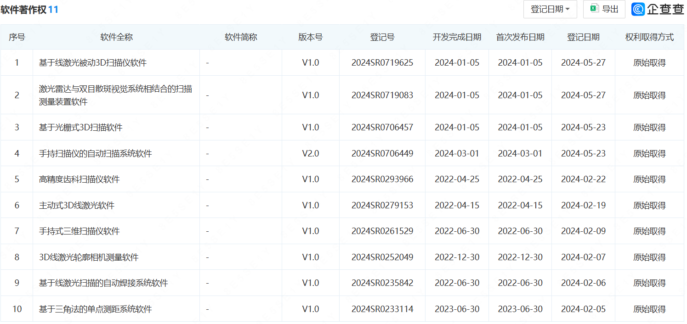
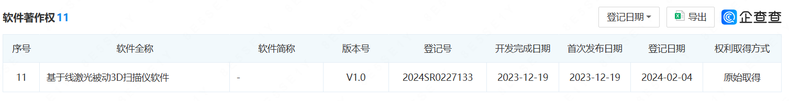
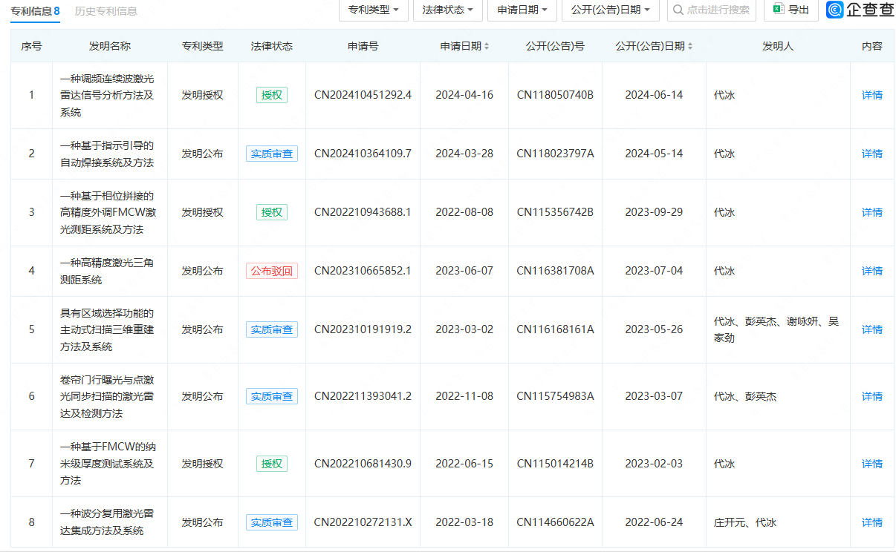

### 二. 技术信息

#### 1. 介绍技术方案

在现代办公环境中，纸质文档依然占据重要地位。然而，随着数字化进程的推进，如何高效地管理和利用这些纸质文档成为了一个亟待解决的问题。传统的手动录入和分类方式效率低下且易出错，无法满足现代企业对信息处理的高效需求。为了应对这一挑战，自动识别、分类和管理打印机扫描的文档技术应运而生。

这种技术通常涉及多个复杂的处理步骤。首先，使用高分辨率扫描仪对纸质文档进行数字化扫描，生成高质量的图像。接下来，通过图像预处理技术，如噪声去除、图像二值化和倾斜校正等，提升图像质量，为后续的光学字符识别（OCR）提供更好的基础。OCR技术能够将图像中的文本信息提取出来，转换为机器可读的文本数据，从而实现文档的电子化管理。

此外，为了提高识别准确性和文档管理的智能化水平，自然语言处理（NLP）技术也被广泛应用。通过命名实体识别（NER）、关键字提取和语义分析等方法，可以对OCR输出的文本进行深入分析，提取出关键信息并进行智能分类。例如，发票中的金额、日期和供应商信息，合同中的签约方和合同条款，报告中的关键结论和建议等，都可以通过NLP技术自动识别和分类。

最后，分类后的文档将被存储在数据库中，并通过元数据管理和全文搜索功能实现高效检索和管理。这不仅大大提高了文档处理的效率，还减少了人工干预的错误率，显著提升了企业的信息化水平。

综上所述，自动识别、分类和管理打印机扫描的文档技术整合了图像处理、OCR和NLP等多项先进技术，能够有效地解决纸质文档的数字化管理问题，具有广阔的应用前景和重要的实用价值。

#### 1.1 背景与技术问题

在许多企业中，纸质文档的处理和管理依然是一个重要的工作内容。传统的手动录入和分类方式不仅耗时耗力，而且容易出错，导致效率低下。随着企业数字化转型的推进，迫切需要一种高效、准确的文档处理技术来替代传统方法。这种技术不仅要能够快速、准确地将纸质文档转换为电子文档，还需要具备智能分类和检索功能，以便于后续的管理和利用。基于以上背景，本技术旨在通过集成先进的图像处理、光学字符识别和自然语言处理技术，提供一种高效、智能的文档处理解决方案。

#### 1.2 技术方案的实现

##### 1.2.1 文档扫描

文档扫描是整个系统的第一步，使用高分辨率扫描仪对纸质文档进行数字化扫描，生成高质量的图像。扫描仪应支持多种文档类型和尺寸，确保能够处理不同类型的纸质文档。

##### 1.2.2 图像预处理

图像预处理包括以下步骤：
- *噪声去除*：使用中值滤波和高斯滤波等方法去除图像中的噪声。
- *二值化处理*：采用Otsu's方法或自适应阈值算法将灰度图像转换为二值图像。
- *图像校正*：使用霍夫变换检测并校正图像中的倾斜角度。
- *特征提取*：利用Canny边缘检测算法提取文本区域的边缘。

##### 1.2.3 光学字符识别（OCR）

OCR模块负责将预处理后的图像转换为机器可读的文本：
- *文本检测*：使用卷积神经网络（如CRNN）识别图像中的文本区域。
- *字符识别*：采用长短期记忆（LSTM）网络对文本区域内的字符进行识别。
- *版面分析*：通过对文本块、行和单词的布局分析，保留文本的版面结构信息。
- *语言模型校正*：结合NLP技术，对OCR输出的文本进行语法和拼写校正。

##### 1.2.4 自然语言处理（NLP）

NLP模块用于分析OCR输出的文本，提取关键信息并分类文档：
- *命名实体识别（NER）*：使用BERT模型识别文本中的重要实体。
- *关键字提取*：采用TF-IDF算法提取文档中的关键信息。
- *语义分析*：通过情感分析和主题建模技术理解文档的语义内容。
- *分类模型*：基于支持向量机（SVM）或深度学习模型对文档进行分类。

##### 1.2.5 文档分类和存储

分类和存储模块负责将分类后的文档存储在数据库中：
- *数据库设计*：使用关系型数据库（如MySQL）或NoSQL数据库（如MongoDB）存储文档和元数据。
- *元数据管理*：包括文档类型、日期、关键字等信息，用于快速检索。
- *版本控制*：支持文档的版本管理，记录文档的修改历史。
- *安全性*：通过加密和访问控制确保文档存储的安全性和隐私保护。

##### 1.2.6 用户界面

用户界面模块提供友好的交互界面，便于用户上传、查看和管理文档：
- *文档上传*：支持用户通过拖拽或选择文件的方式上传文档。
- *分类查看*：用户可以按类别查看存储的文档，方便管理和查找。
- *全文搜索*：基于关键字和元数据的全文搜索功能，快速定位目标文档。
- *人工校正*：允许用户手动修正分类错误，提高系统的准确性。

#### 2. 本技术带来的有益效果

本技术通过集成多种先进的图像处理、光学字符识别和自然语言处理技术，实现了对纸质文档的高效、准确处理。具体有以下几个有益效果：
- *提高效率*：自动化处理大大减少了手工录入和分类的时间，提高了文档处理效率。
- *降低错误率*：采用先进的OCR和NLP技术，显著降低了人工录入和分类的错误率。
- *智能分类和检索*：通过智能分类和全文搜索功能，用户可以快速找到所需文档，提高了文档管理的便利性。
- *增强安全性*：通过数据库的加密和访问控制，确保文档的存储和管理安全，保护用户隐私。
- *便于管理*：系统提供了友好的用户界面和强大的文档管理功能，便于用户对文档进行上传、查看和管理。

#### 3. 与本技术最接近的现有技术及其缺点

目前市场上已有的文档管理系统主要依赖于手动录入和简单的OCR技术，存在以下缺点：
- *手动录入效率低*：需要大量的人工参与，耗时耗力，容易出错。
- *识别准确率低*：传统的OCR技术对复杂版面的文档识别效果不佳，容易出现识别错误。
- *缺乏智能分类*：现有系统通常只能进行简单的分类，无法根据文档内容进行智能分类和检索。
- *安全性不足*：一些系统缺乏完善的安全措施，容易导致文档泄露和隐私问题。

相比之下，本技术通过集成先进的图像处理、OCR和NLP技术，解决了现有技术中的这些缺点，提供了更高效、更智能、更安全的文档管理解决方案。

