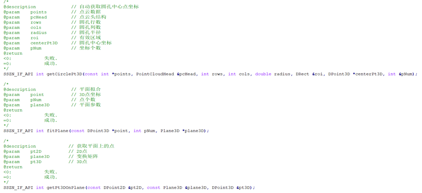
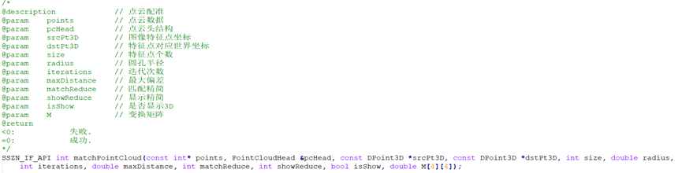
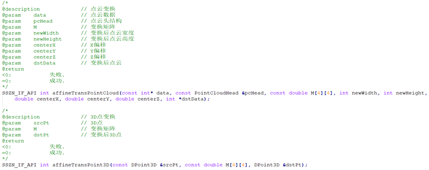

### 获取图像特征点坐标

fitPlane和 getPt3DPlane:先拟合标定块平面，然后通过2D特征点，计算出平面上的3D点坐标；

> 图中的第一个是直接获取点坐标的，这里不用看



```cpp

/*平面拟合*/

int CloudCorrectClassDlg::FitPlane(CLCloud &mCloud, HTuple &mRows, HTuple &mCols, int mIterations, double mThreshold, CLTuple *mPlaneDatas)
{
    if(mCloud.cols < 1 || mCloud.rows < 1)
    {
        return -1;
    }
    if(mRows.Length() < 1 || mRows.Length() != mCols.Length())
    {
        return -1;
    }

    pcl::PointCloud<pcl::PointXYZ> cloud;             //创建点云对象，用于存储点云数据
    //填充点云数据
    int mLength = mRows.Length();
    int mStep = mCloud.cols;
    cloud.width  = mLength;
    cloud.height = 1;
    cloud.points.resize(mLength);
    Hlong *rows = mRows.LArr();
    Hlong *cols = mCols.LArr();
    float mInvx = mCloud.xInterval;
    float mInvy = mCloud.yInterval;
    for(int i=0; i<mLength; i++)
    {
        int mIndex = rows[i] * mStep + cols[i];
        cloud.points[i].x = cols[i] * mInvx;
        cloud.points[i].y = rows[i] * mInvy;
        cloud.points[i].z = mCloud.zs[mIndex];
    }

    pcl::ModelCoefficients::Ptr coefficients(new pcl::ModelCoefficients); //存储输出的模型的系数
    pcl::PointIndices::Ptr inliers(new pcl::PointIndices); //存储内点，使用的点
    pcl::SACSegmentation<pcl::PointXYZ> seg;
    //可选设置;设置模型系数需要优化
    seg.setOptimizeCoefficients(true);
    //必须设置
    seg.setModelType(pcl::SACMODEL_PLANE); //设置模型类型，检测平面
    seg.setMethodType(pcl::SAC_RANSAC);      //设置方法【聚类或随机样本一致性】
    seg.setMaxIterations(mIterations);//设置最大迭代次数
    seg.setDistanceThreshold(mThreshold);
    seg.setInputCloud(cloud.makeShared());
    seg.segment(*inliers, *coefficients);    //分割操作

    //显示模型的系数
    double mDatas[4];
    mDatas[0] = coefficients->values[0];
    mDatas[1] = coefficients->values[1];
    mDatas[2] = coefficients->values[2];
    mDatas[3] = coefficients->values[3];
    *mPlaneDatas = CLTuple(mDatas, 4);

    return 0;
}

/*获取平面上的点*/

   这个函数/实现还没有找到

```
 
### 通过点云配准，计算变换矩阵
 
 

```shell
  该实现没有找到

```

### 对点云数据和单点坐标进行仿射变换

1. 点云变换  2.点的仿射变换


 
```cpp
   AffineTransPointCloud 的实现没有找到
   HalconCpp::AffineTransPoint3d(mMat, hXs, hYs, hZs, &hDx, &hDy, &hDz);

```


示例：
 
若isShow参数为true，计算结束后会弹出点云与目标位置的标定效果，如下图。
 

