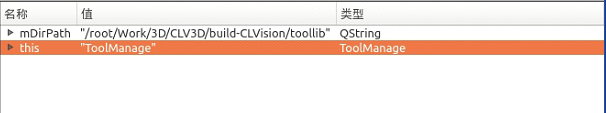
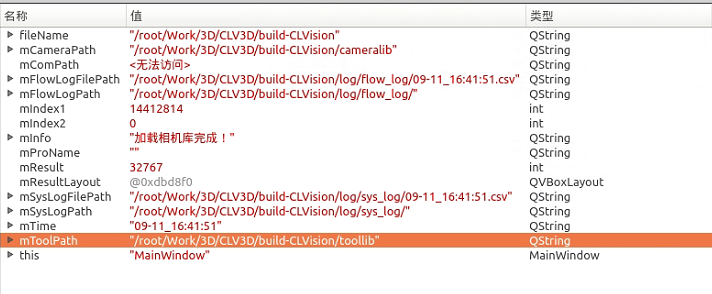
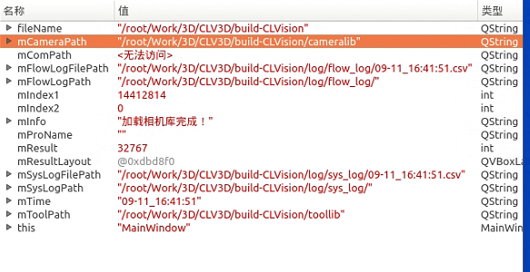
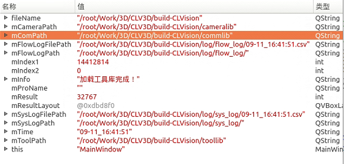

### 插件接口类 (CloudMirror)

```cpp
#ifndef CLOUDMIRROR_H
#define CLOUDMIRROR_H

/*********************************************************************************
 * NAME:  HONGKELI
 * DATA:    2024/03/27
 * 点云镜像
 * ********************************************************************************/

#include <QtCore/qglobal.h>
#include <fstream>
#include <vector>
#include <QString>
#include <QIcon>
#include <QDebug>

#include "toolbase.h"
#include "CloudMirror/CL_ToolDerived.h"

#if defined(CLOUDMIRROR_LIBRARY)
// 导出宏定义，用于确定是导出 (Q_DECL_EXPORT) 还是导入 (Q_DECL_IMPORT)
#  define CLOUDMIRRORSHARED_EXPORT Q_DECL_EXPORT
#else
#  define CLOUDMIRRORSHARED_EXPORT Q_DECL_IMPORT
#endif

// 外部 C 接口，用于获取插件 ID
extern "C" CLOUDMIRRORSHARED_EXPORT bool GetID(QString *mDllId);

// 外部 C 接口，获取工具信息列表
extern "C" CLOUDMIRRORSHARED_EXPORT bool GetToolInfo(vector<ToolInfoStructure> *mToolInfoList);

// 外部 C 接口，根据工具信息获取工具对象
extern "C" CLOUDMIRRORSHARED_EXPORT bool GetToolObj(ToolInfoStructure ToolInfo, ToolBase **mToolBase);

// 外部 C 接口，复制工具对象
extern "C" CLOUDMIRRORSHARED_EXPORT bool CloneToolObj(ToolBase *mSrcTool, ToolBase **mToolBase);

// 外部 C 接口，获取工具图标
extern "C" CLOUDMIRRORSHARED_EXPORT bool GetToolIco(ToolInfoStructure ToolInfo, QIcon *mIcon);

// 外部 C 接口，获取工具说明
extern "C" CLOUDMIRRORSHARED_EXPORT bool GetToolExplain(ToolInfoStructure ToolInfo, QString *mExplain);

// 外部 C 接口，重置序列号
extern "C" CLOUDMIRRORSHARED_EXPORT bool ResetSerialNumber();

#endif // CLOUDMIRROR_H

```

`CloudMirror` 主要定义了一个插件的接口，通过导出一系列 `extern "C"` 的函数，这些函数用于外部调用插件中的功能。这符合插件架构的常规设计，插件可以动态加载，并通过标准化的接口与主程序进行通信。这里提供的接口函数包括：
- `GetID()`：获取插件的 ID。
- `GetToolInfo()`：获取插件的工具信息。
- `GetToolObj()` 和 `CloneToolObj()`：创建和复制工具对象。
- `GetToolIco()` 和 `GetToolExplain()`：获取工具的图标和解释。
- `ResetSerialNumber()`：重置序列号。

这些接口使主程序能够通过动态链接库 (.dll) 访问插件的功能，支持动态加载和插件间的解耦。

### 插件接口管理类ToolDllManager

```cpp
#ifndef TOOLDLLMANAGER_H
#define TOOLDLLMANAGER_H

#include "dllmanager_global.h"
#include <QWidget>
#include <QDir>
#include <QHash>
#include <QList>
#include <QString>
#include <QStringList>
#include <string>
#include "taskbase.h"
#include "toolbase.h"
#include "toollist.h"
#include <qdebug.h>
#include <QHeaderView>

using namespace std;

class DLLMANAGERSHARED_EXPORT ToolDllManager
{
public:
    // 构造函数，初始化工具管理器
    ToolDllManager();
    
    // 析构函数，释放资源
    ~ToolDllManager();

    // 从指定目录获取工具列表，返回工具个数
    int GetToolList(QString mDirPath);
    
    // 释放资源
    void Dispose();
    
    // 根据工具类型和名称创建新的工具对象
    int NewToolObj(string mToolType, string mToolName, ToolBase **mNewTool);
    
    // 复制工具对象
    int CopyToolObj(ToolBase *mSrcTool, ToolBase **mNewTool);
    
    // 设置任务 ID
    void SetTaskID(string mClassID);
    
    // 获取工具图标
    int GetToolShowIco(string mToolType, string mToolName, QIcon *mIcon);
    
    // 获取工具说明
    int GetToolShowExplain(string mToolType, string mToolName, QString *mExplain);
    
    // 重置工具序列号
    void ResetToolSerialNumber();

private:
    // 从指定目录获取 .dll 文件，返回文件数量
    int GetToolDll(QString mDirPath);
    
    // 从文件路径获取工具对象信息
    int GetToolObjInfo(string mFilePath);

public:
    // 工具名称列表
    QList<ToolInfoStructure> tool_name_list;

private:
    // .dll 文件列表
    QList<QString> dll_list;
    
    // .dll 文件对应的哈希表
    QHash<QString, QString> dll_hash;
    
    // .dll 文件句柄列表，用于动态加载和卸载
    QHash<QString, void*> dll_handle_list;
    
    // 当前任务 ID
    string task_id;
};

#endif // TOOLDLLMANAGER_H
```

`ToolDllManager` 类看起来是用于管理这些插件的工具类。它的职责是从一个固定目录加载 .dll 文件，并管理插件的生命周期。具体功能包括：
- `GetToolList()` 和 `GetToolDll()`：从指定目录获取插件列表和 .dll 文件。
- `NewToolObj()` 和 `CopyToolObj()`：创建或复制工具对象。
- `GetToolShowIco()` 和 `GetToolShowExplain()`：获取工具的图标和解释。
- `ResetToolSerialNumber()`：重置工具的序列号。

此外，这里还使用了 `QList` 和 `QHash` 来存储和管理加载的插件信息。

`ToolDllManager` 确用于对接和管理插件的接口实现类，它通过加载插件（动态链接库），然后根据插件提供的接口进行调用，实现了插件的管理和功能调用。


### 插件加载的路径

1.软件启动时：<br>
dll路径："/root/Work/3D/CLV3D/build-CLVision/toollib"



打开该路径，可以看到确实有libCloudConvertCircle.so， libCloudCorrect.so， libDefectChecks.so等18个.so文件




### 涉及插件库的功能和工具

1.软件启动时加载插件: mainwindow

2.软件升级：softwareupdatedlg

3.包括PointAndLine在内的18个插件的pro文件的编译输出目录<br>
TARGET = /root/Work/3D/CLV3D/build-CLVision/toollib/PointAndLine


### 相机库加载的路径



1.软件启动时加载插件: mainwindow

2.软件升级：softwareupdatedlg

3.深视智能的激光头项目pro文件的编译输出目录：<br>
TARGET = /root/Work/3D/CLV3D/build-CLVision/cameralib/SSZNLaser


### 公共库加载的路径



1.软件启动时加载插件: mainwindow

2.软件升级：softwareupdatedlg

3.TCP通信项目TCPComm.pro的编译输出目录：<br>
TARGET = /opt/.CLVision/commlib/TCPComm


