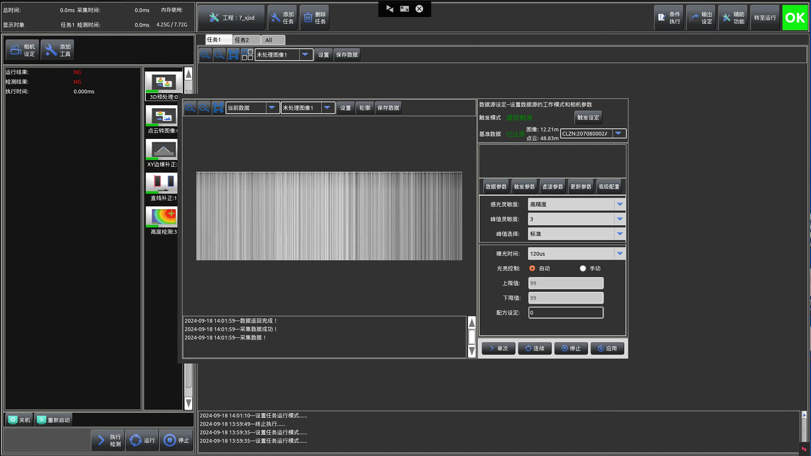
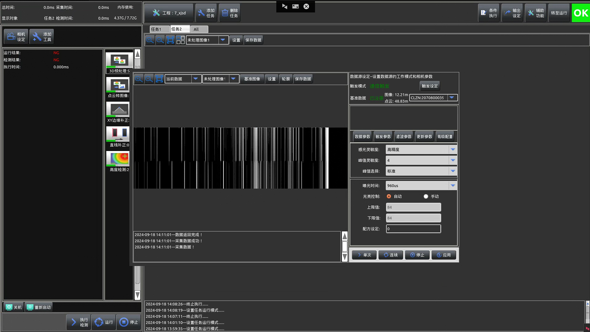
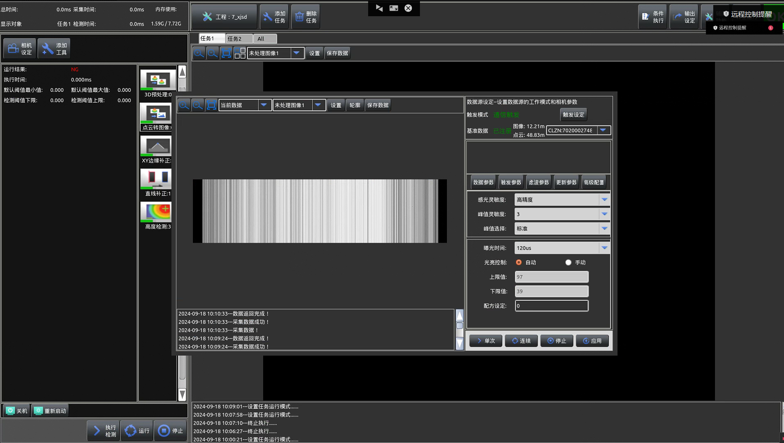
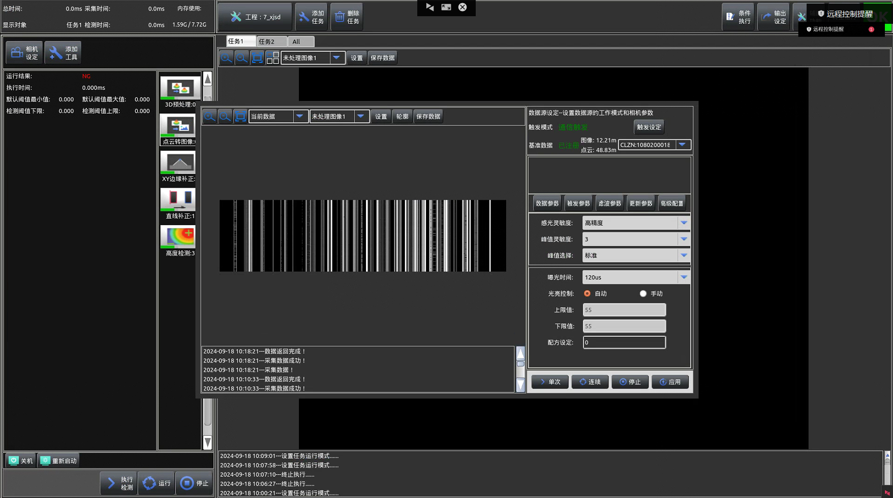
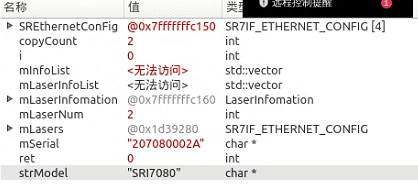
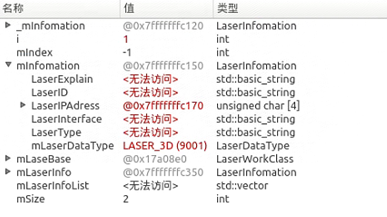
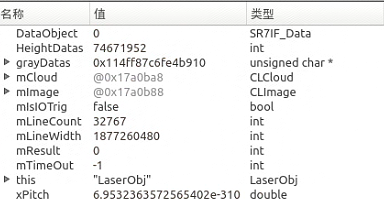

## 无采集器002A 

ip 192.168.100.10

## 无采集器0039  

ip：192.168.101.10

## 采集器相机2748  

连接IP地址为192.168.101.xx

## 采集器相机0018

连接ip地址为192.168.100.xx

## 相机连接

1.序列号 mSerial  strModel mLaserNum

2.相机对象 mInfomation 相机序号 mIndex

3.采图过程  mCloud

## 相机采集顺序

1. 单次采集

int DatasSourceDlg::GrabDatas(int mGrabType)

1.2.激光头采集

mResult = laser_obj->GrabOnce(this);

1.3 调用相机类的具体方法
int LaserClass::GrabOnce(DatasSourceDlg *mDataSource)

1.4 和任务绑定
  
m_TaskName
        // 获取使用的任务名称
        QString mUseTaskName = data_source->task_class->task_name;
        // 更新相机参数
        QString mMessage;
        laser_obj->UpdateCameraParm(&mMessage, "",mUseTaskName);//添加任务运行时修改参数
        // 执行单次采集
        int mResult = laser_obj->GrabOnce(mUseTaskName);

1.5 相机模块多线程

int LaserWorkClass::GrabOnce(QString mTaskName)

1.6 真正的数据采集

// 开始采集数据形成点云
int LaserObj::StartGrab(bool mIsIOTrig, CLImage *mImage, CLCloud *mCloud)

1.7 传送3Ddian云数据
int DatasSourceDlg::PushData_3D(CLImage &mImage, CLCloud &mCloud)

1.8 采图结束的信号：

  emit EmitGrabEnd();

2.采集时接收数据
          // 如果开始测量成功
        if(mResult == 0)
        {
            // 创建数据对象
            SR7IF_Data DataObject = NULL;
            // 接收数据
            mResult = SR7IF_ReceiveData(laser_index, DataObject);
            // 如果接收数据失败，则停止测量并返回错误码-1
            if(mResult !=0)
            {
                SR7IF_StopMeasure(laser_index);
                return -1;
            }

            // 获取批处理行数
            int mLineCount = SR7IF_ProfilePointCount(laser_index, DataObject);
            //获取批处理宽度
            int mLineWidth = SR7IF_ProfileDataWidth(laser_index, DataObject);
            //数据x方向间距(mm)
            double xPitch = SR7IF_ProfileData_XPitch(laser_index, DataObject);
            // 如果行数或宽度无效，则返回错误码-1
            if(mLineCount <= 0 || mLineWidth <= 0)
            {
                return -1;
            }
            // 分配内存存储高度数据和灰度数据
            int * HeightDatas = new int[mLineCount * mLineWidth];
            // 获取高度数据
            mResult = SR7IF_GetProfileData(laser_index, DataObject, HeightDatas);
            // 如果获取高度数据失败，释放内存并返回错误码-1
            if(mResult != 0)
            {
                delete[] HeightDatas;
                return -1;
            }
            // 分配内存存储灰度数据
            unsigned char* grayDatas = new unsigned char[mLineCount * mLineWidth];
            // 获取灰度数据
            mResult = SR7IF_GetIntensityData(laser_index, DataObject, grayDatas);
            if(mResult != 0)
            {
                // 如果获取灰度数据失败，释放高度数据内存
                delete[] HeightDatas;
                // 释放灰度数据内存
                delete[] grayDatas;
                return -1;
            }
            // 清除云数据并初始化大小
            mCloud->Clear();
            mCloud->InitSize(mLineCount, mLineWidth, xPitch, y_interval);
            // 填充云数据
            for(int row = 0; row < mLineCount; row++)
            {
                for(int col=0; col<mLineWidth; col++)
                {
                    int mIndex = row*mLineWidth + col;
                    // 将高度数据转换为实际高度值
                    double mZ = HeightDatas[mIndex] / 100000.0;
                    mCloud->zs[mIndex]  = mZ;
                }
            }
            // 设置云数据的x方向间距
            mCloud->xInterval = xPitch;
            // 设置云数据的y方向间距
            mCloud->yInterval = y_interval;

            //Gen Image, (need Test)
            // 生成图像数据
            mImage->Clear();
            *mImage = CLImage(mLineCount, mLineWidth, IMAGE_GRAB8, grayDatas);

            //获取编码器数据
            //定义编码器数据缓存---双激光头会导致异常闪退--且不需要使用此处数据，故暂时屏蔽
            //unsigned int* Encoder=new unsigned int[mLineCount];
            //SR7IF_GetEncoder(laser_index,DataObject,Encoder);
        
            // 释放之前分配的内存
            delete[] HeightDatas;
            delete[] grayDatas;
//            delete[] Encoder;
            return 0;
        }
    }
    return -1;
}

