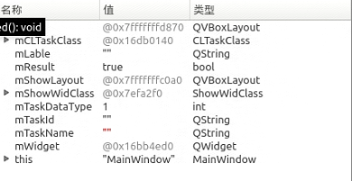
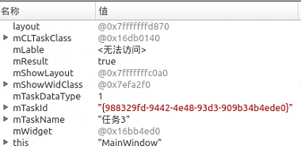

## 添加任务

函数：void MainWindow::on_btnAddTask_clicked()

gen_task_index   任务索引




## 任务ID

QString task_id;  mTaskId

```cpp

CLTaskClassDlg::CLTaskClassDlg(QWidget *parent) :
    QWidget(parent),
    ui(new Ui::CLTaskClassDlg)
{
    ui->setupUi(this);

    QUuid id = QUuid::createUuid();
    task_id = id.toString();

    //任务自动工作模式(0--软触发；1--硬触发；2--任务跟随)
    mTaskMode = 0;
}
```





##  显示隐藏槽函数：

void MainWindow::OnTimerMonitor_BeginRunSszn()


## 任务切换

关键操作：

使用 task_hash.value(taskID_list.at(TaskIndex)) 获取当前任务对象 CLTaskClass 的实例，通过它可以访问到任务的相关信息。
切换任务后，根据新的 TaskIndex 再次从 taskID_list 中获取新的任务 task_id，并用它来操作任务对象。


## 获取任务名称


if(!taskID_list.empty() && taskID_list.length() > 0)
{
    // 遍历任务ID列表中的每个任务ID
    for(int i=0; i< taskID_list.length(); i++)
    {
        // 使用当前的任务ID从哈希表中获取对应的任务对象
        // 'task_hash' 是一个哈希表，键是任务ID，值是任务对象的指针
        // 'taskID_list' 是一个包含任务ID的列表
        // 'taskID_list.at(i)' 获取列表中的第i个任务ID
        // 'task_hash.value(taskID_list.at(i))' 根据任务ID获取对应的任务对象
        CLTaskClass *task = task_hash.value(taskID_list.at(i));
        
        // 调用任务对象的 'SetRunMode' 方法来设置运行模式
        // 'mAdmin' 和 'mIsAuto' 是传递给 'SetRunMode' 方法的参数
        // 'mAdmin' 可能表示管理员模式，而 'mIsAuto' 可能表示是否启用自动模式
        task->SetRunMode(mAdmin, mIsAuto);
    }
}

